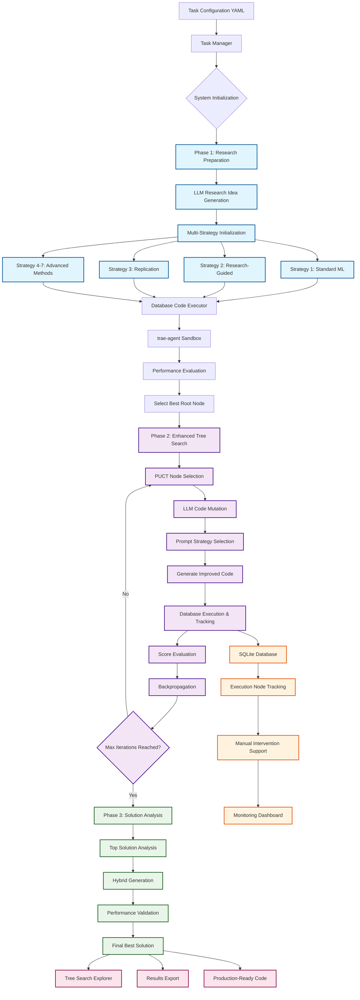
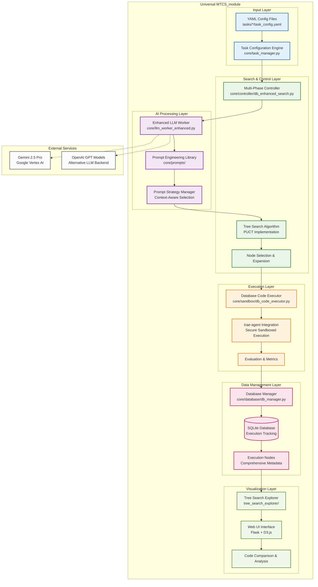
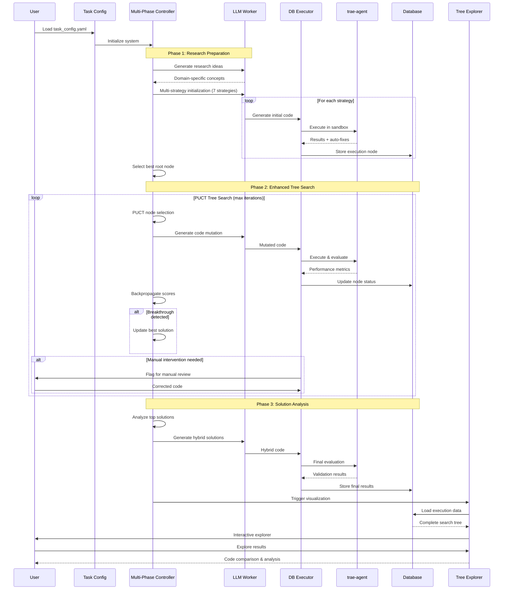
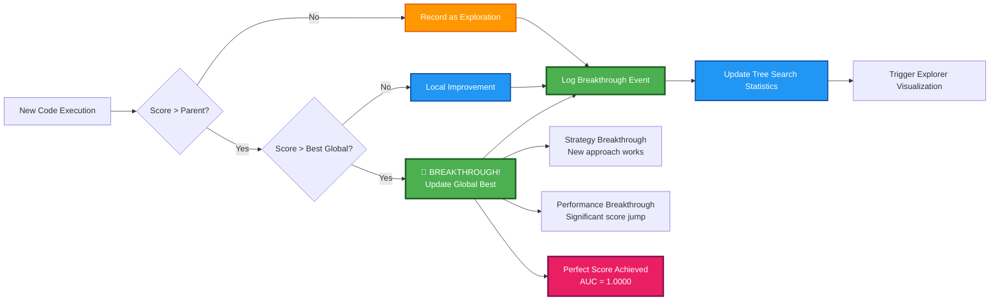
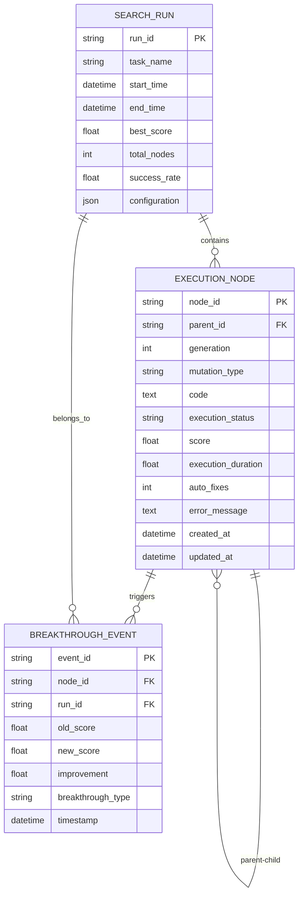

# Universal MTCS_module - Architecture Diagram

## System Overview Flowchart



## Detailed Component Architecture



## Multi-Phase Execution Flow



## Performance Breakthrough Detection



## Database-Driven Execution Model



## Key Achievements Visualization

```mermaid
gitgraph
    commit id: "Start: 0.5111 AUC"
    branch logistic_regression
    checkout logistic_regression
    commit id: "Replicate LR: 0.9845"
    
    checkout main
    branch random_forest
    commit id: "Replicate RF: 0.9924"
    
    checkout main
    branch target_improvement
    commit id: "Target Improve: 0.9787"
    
    checkout main
    branch perfect_solution
    commit id: "🎉 PERFECT: 1.0000 AUC"
    commit id: "Confirmed: 1.0000 AUC"
    
    checkout main
    merge logistic_regression
    merge random_forest
    merge target_improvement
    merge perfect_solution
    commit id: "Final Best: 1.0000"
    commit id: "69.2% Success Rate"
    commit id: "40.2 min Runtime"
```