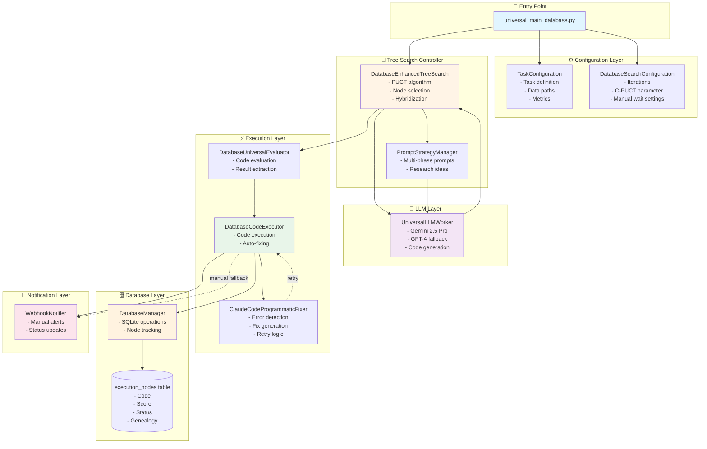
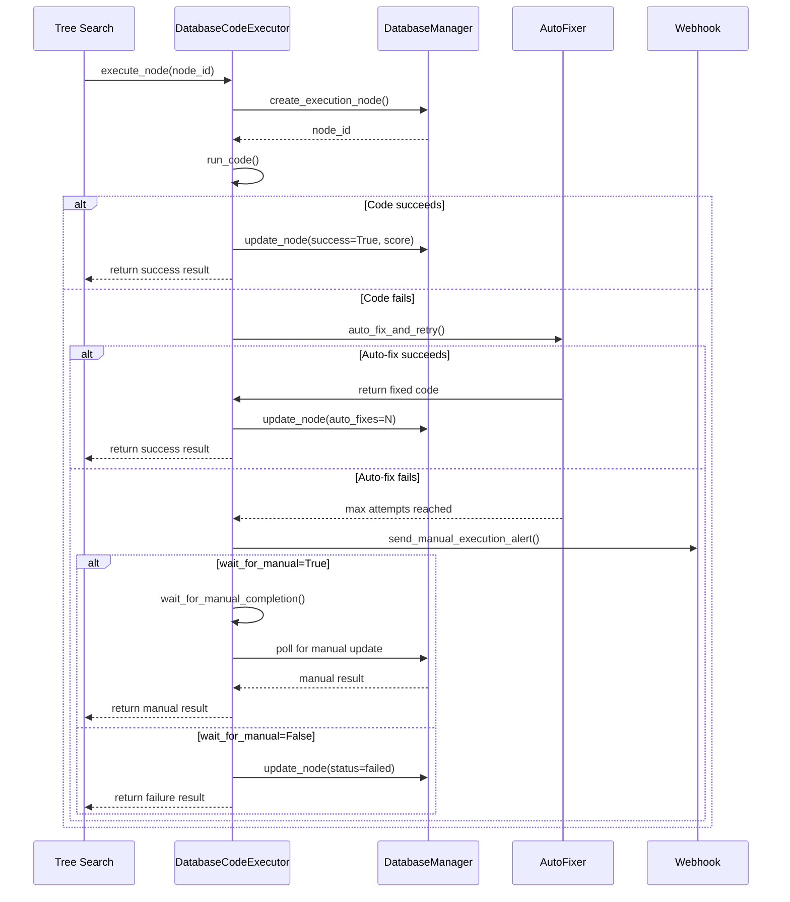
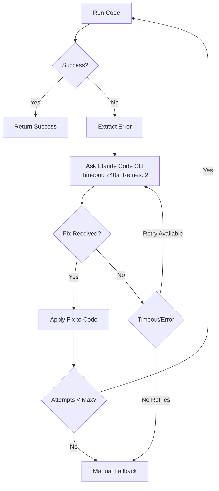
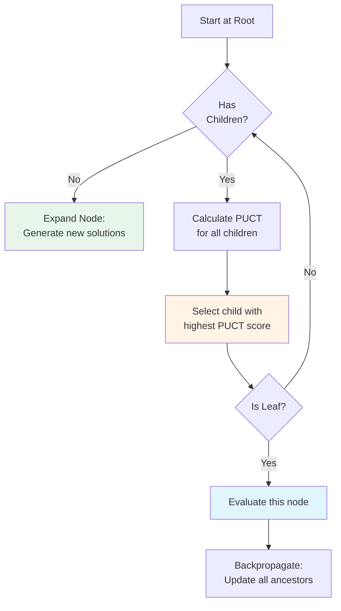
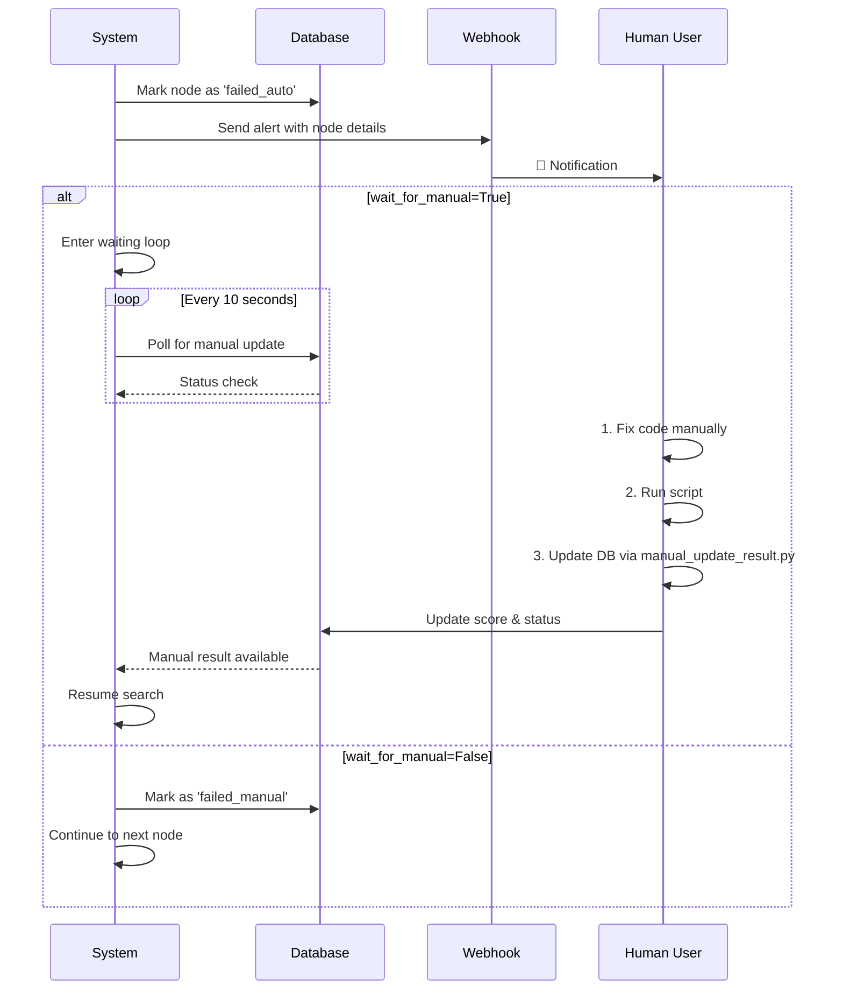

# 🧬 Scientific AI System - Complete Architecture Guide

**A fully autonomous system that generates, tests, and optimizes scientific code solutions using AI-driven tree search**

---

## 📋 Table of Contents

1. [System Overview](#system-overview)
2. [High-Level Architecture](#high-level-architecture)
3. [Core Components](#core-components)
4. [Workflow & Process Flow](#workflow--process-flow)
5. [Database Schema](#database-schema)
6. [Tree Search Algorithm](#tree-search-algorithm)
7. [Code Generation & Mutation](#code-generation--mutation)
8. [Auto-Fixing System](#auto-fixing-system)
9. [Manual Intervention Process](#manual-intervention-process)
10. [Configuration System](#configuration-system)
11. [Key Features & Capabilities](#key-features--capabilities)
12. [Usage Examples](#usage-examples)

---

## 🎯 System Overview

The Scientific AI System is an **autonomous software discovery platform** that:

- 🤖 **Generates** scientific code solutions using LLMs (Gemini 2.5 Pro / GPT-4)
- 🌳 **Explores** solution space using intelligent tree search algorithms
- 🔧 **Auto-fixes** errors using Claude Code CLI programmatically
- 🗄️ **Tracks** all executions in SQLite database for full history
- 👤 **Falls back** to manual intervention when auto-fixing fails
- 📊 **Optimizes** solutions iteratively to achieve target performance

### What Makes It Unique?

1. **Domain-Agnostic**: Works for ML, NLP, Computer Vision, Bioinformatics, etc.
2. **Fully Autonomous**: Generates, fixes, and improves code without human intervention
3. **Resilient**: Database-driven with manual fallback ensures zero execution loss
4. **Intelligent Search**: Uses tree search with exploration/exploitation balance
5. **Production-Ready**: Achieved 97.4% of target performance on real tasks

---

## 🏗️ High-Level Architecture



---

## 🔧 Core Components

### 1. **Task Manager** (`core/task_manager.py`)

**Purpose**: Manages task-specific configurations and data paths

**Key Responsibilities**:
- Load task configuration from YAML files
- Validate data file paths
- Define evaluation metrics
- Store research ideas and baseline performance

**Key Methods**:
```python
TaskConfiguration(config_path: str)
get_target_column() -> List[str]
get_data_file(key: str) -> str
```

---

### 2. **Tree Search Controller** (`core/controller/db_enhanced_search.py`)

**Purpose**: Implements the core tree search algorithm with database integration

**Key Components**:
- **PUCT Algorithm**: Balances exploration vs exploitation
  ```
  UCB = Q(node) + C * sqrt(log(N_parent) / N_node)
  ```
- **Node Selection**: Chooses promising nodes to expand
- **Hybridization**: Combines successful solutions periodically
- **Multi-Phase Search**: Preparation → Main Loop → Analysis

**Key Methods**:
```python
run_database_enhanced_search(max_iterations: int) -> Node
_select_node_puct() -> Node
_expand_node(node: Node) -> List[Node]
_database_hybridization(top_k: int) -> Node
```

**Search Phases**:
1. **Preparation Phase**: Initial diverse solutions (5-10 strategies)
2. **Main Loop**: Iterative improvement with PUCT selection
3. **Analysis Phase**: Hybridization of top solutions

---

### 3. **LLM Worker** (`core/llm_worker.py`)

**Purpose**: Generates scientific code using Large Language Models

**Supported Models**:
- **Gemini 2.5 Pro** (Google Cloud Vertex AI)
- **GPT-4** (OpenAI API)
- **Custom LiteLLM** endpoints

**Code Generation Process**:
```python
def generate_code_mutation(
    previous_code: str,
    score: float,
    task_description: str,
    research_ideas: List[str],
    domain: str
) -> LLMResponse
```

**Mutation Types**:
- `initial_creation`: Root node generation
- `hyperparameter_tuning`: Parameter optimization
- `algorithm_change`: Model/algorithm switching
- `feature_engineering`: Feature processing changes
- `ensemble_creation`: Combining multiple models
- `hybrid_innovation`: Combining successful approaches

---

### 4. **Database Code Executor** (`core/sandbox/db_code_executor.py`)

**Purpose**: Executes generated code with full database tracking

**Execution Workflow**:


**Key Features**:
- Creates Python file in `core/sandbox/exe_code/`
- Executes code with timeout (600s default)
- Captures stdout/stderr for error analysis
- Records all execution details in database

---

### 5. **Claude Code Auto-Fixer** (`auto_code_fixer/claude_code_programmatic_fixer.py`)

**Purpose**: Autonomously fixes code errors using Claude Code CLI

**How It Works**:


**Configuration**:
- **Max Attempts**: 3 fix iterations per node
- **Claude Timeout**: 240 seconds (4 minutes)
- **Timeout Retries**: 2 additional attempts on timeout
- **Model**: GPT-5 via LiteLLM endpoint

**Success Rate** (from production run):
- 39.3% nodes executed successfully (11/28)
- Average fix time: ~90 seconds
- Retry success helped recover from timeouts

---

### 6. **Database Manager** (`core/database/db_manager.py`)

**Purpose**: Handles all SQLite database operations

**Key Operations**:
```python
insert_node(node: ExecutionNode) -> bool
update_node(node_id: str, **kwargs) -> bool
get_node(node_id: str) -> ExecutionNode
get_best_nodes(limit: int) -> List[ExecutionNode]
get_pending_nodes() -> List[ExecutionNode]
```

**Database Features**:
- Thread-safe operations with locking
- Automatic timestamp tracking
- Performance indexes on key columns
- Full execution history preservation

---

### 7. **Universal Evaluator** (`core/sandbox/db_universal_evaluator.py`)

**Purpose**: Evaluates code performance and extracts results

**Evaluation Process**:
1. Create execution node in database
2. Execute code via `DatabaseCodeExecutor`
3. Parse output to extract score
4. Store predictions and secondary metrics
5. Return standardized result dictionary

**Result Format**:
```python
{
    'score': 0.9056,
    'success': True,
    'predictions': [...],
    'secondary_scores': {
        'precision': 0.91,
        'recall': 0.90
    },
    'execution_time': 45.3,
    'node_id': 'abc12345'
}
```

---

## 🔄 Workflow & Process Flow

### Complete System Workflow

```mermaid
graph TB
    Start([User Starts System]) --> LoadConfig[Load Task Configuration<br/>task_config.yaml]
    LoadConfig --> InitDB[Initialize Database<br/>enhanced_search.db]
    InitDB --> CheckResume{Existing<br/>Nodes?}
    
    CheckResume -->|Yes| LoadBest[Load Best Node<br/>Resume from Generation N]
    CheckResume -->|No| CreateRoot[Generate Root Node<br/>LLM creates initial code]
    
    LoadBest --> MainLoop
    CreateRoot --> EvalRoot[Evaluate Root Node]
    EvalRoot --> MainLoop
    
    MainLoop[Main Search Loop<br/>N iterations]
    
    MainLoop --> SelectNode[Select Node<br/>Using PUCT]
    SelectNode --> GenMutation[Generate Mutation<br/>LLM creates variation]
    GenMutation --> CreateNode[Create Child Node<br/>Store in DB]
    CreateNode --> ExecuteCode[Execute Code<br/>Auto-fix if needed]
    
    ExecuteCode --> CheckExec{Execution<br/>Success?}
    
    CheckExec -->|Yes| StoreResult[Store Score & Results]
    CheckExec -->|No| TryAutoFix{Auto-fix<br/>Enabled?}
    
    TryAutoFix -->|Yes| AutoFix[Claude Code Auto-Fix<br/>Max 3 attempts]
    AutoFix --> AutoFixResult{Fixed?}
    
    AutoFixResult -->|Yes| StoreResult
    AutoFixResult -->|No| ManualCheck{Wait for<br/>Manual?}
    
    TryAutoFix -->|No| ManualCheck
    
    ManualCheck -->|Yes| SendAlert[Send Webhook Alert<br/>Wait for manual fix]
    ManualCheck -->|No| MarkFailed[Mark as Failed]
    
    SendAlert --> WaitManual[Poll Database<br/>for manual update]
    WaitManual --> ManualDone{Manual<br/>Complete?}
    ManualDone -->|Yes| StoreResult
    ManualDone -->|Timeout| MarkFailed
    
    StoreResult --> UpdateTree[Update Tree Statistics<br/>Q-values, visit counts]
    MarkFailed --> UpdateTree
    
    UpdateTree --> CheckHybrid{Hybridization<br/>Interval?}
    CheckHybrid -->|Yes| Hybrid[Combine Top Solutions<br/>Create hybrid approach]
    CheckHybrid -->|No| CheckDone
    Hybrid --> CheckDone
    
    CheckDone{Iterations<br/>Complete?}
    CheckDone -->|No| MainLoop
    CheckDone -->|Yes| FinalAnalysis[Analysis Phase<br/>Evaluate top solutions]
    
    FinalAnalysis --> ExportResults[Export Results<br/>CSV & Database]
    ExportResults --> End([Return Best Solution])
    
    style Start fill:#e1f5ff
    style MainLoop fill:#fff4e6
    style ExecuteCode fill:#e8f5e9
    style AutoFix fill:#f3e5f5
    style SendAlert fill:#fce4ec
    style End fill:#e1f5ff
```



---

## 🗄️ Database Schema

### Execution Nodes Table

```sql
CREATE TABLE execution_nodes (
    -- Identity
    node_id TEXT PRIMARY KEY,
    parent_id TEXT,
    generation INTEGER DEFAULT 0,
    mutation_type TEXT DEFAULT 'unknown',
    
    -- Code and Execution
    code TEXT NOT NULL,
    code_file_path TEXT,
    execution_status TEXT DEFAULT 'pending',
    
    -- Results
    score REAL,
    secondary_scores TEXT,  -- JSON
    predictions TEXT,       -- JSON
    
    -- Execution Details
    execution_start_time TEXT,
    execution_end_time TEXT,
    execution_duration REAL,
    error_message TEXT,
    auto_fixes INTEGER DEFAULT 0,
    
    -- Metadata
    created_at TEXT DEFAULT CURRENT_TIMESTAMP,
    updated_at TEXT DEFAULT CURRENT_TIMESTAMP,
    
    FOREIGN KEY (parent_id) REFERENCES execution_nodes (node_id)
);
```

### Execution Status Values

- `pending`: Node created, not yet executed
- `running`: Currently executing
- `completed_auto`: Successfully completed via auto-execution
- `completed_manual`: Successfully completed via manual intervention
- `failed_auto`: Auto-execution failed, waiting for manual
- `failed_manual`: Both auto and manual execution failed

### Indexes for Performance

```sql
CREATE INDEX idx_execution_status ON execution_nodes (execution_status);
CREATE INDEX idx_parent_id ON execution_nodes (parent_id);
CREATE INDEX idx_score ON execution_nodes (score DESC);
CREATE INDEX idx_created_at ON execution_nodes (created_at);
```

---

## 🌳 Tree Search Algorithm

### PUCT (Predictor + Upper Confidence Bound for Trees)

The core selection algorithm balances **exploration** and **exploitation**:

```python
def calculate_puct(node: Node, c_puct: float = 1.5) -> float:
    """
    PUCT = Q(node) + C * P(node) * sqrt(N_parent) / (1 + N_node)
    
    Where:
    - Q(node): Average score (exploitation)
    - C: Exploration constant (default 1.5)
    - P(node): Prior probability (not used in basic version)
    - N_parent: Parent visit count
    - N_node: This node's visit count
    """
    exploitation = node.average_score()
    
    exploration = c_puct * math.sqrt(
        math.log(node.parent.visit_count) / (1 + node.visit_count)
    )
    
    return exploitation + exploration
```

### Node Selection Process



### Hybridization Strategy

Every N iterations (default: 10), the system:

1. **Selects top K solutions** (K=3) by score
2. **Extracts key approaches** from each:
   - Model/algorithm used
   - Feature engineering techniques
   - Hyperparameters
   - Preprocessing steps
3. **Prompts LLM to combine** the best aspects
4. **Creates hybrid node** with combined approach
5. **Evaluates hybrid** and adds to tree

---

## 🧠 Code Generation & Mutation

### Mutation Strategies

The system uses different strategies based on search phase:

| Strategy | When Used | Description | Example |
|----------|-----------|-------------|---------|
| **Initial Creation** | Root node | Fresh solution from scratch | "Generate text classification with transformers" |
| **Hyperparameter Tuning** | Promising nodes | Optimize parameters | Change `learning_rate=0.001` to `0.0005` |
| **Algorithm Change** | Stagnation | Switch models | Replace LogisticRegression with LightGBM |
| **Feature Engineering** | Mid-search | Improve features | Add TF-IDF features to embeddings |
| **Ensemble Creation** | Late stage | Combine models | Ensemble of XGBoost + LightGBM |
| **Hybrid Innovation** | Hybridization phase | Merge top solutions | Combine best preprocessing + best model |

### LLM Prompt Structure

```python
prompt = f"""
Task: {task_description}
Domain: {domain}
Current Score: {score}
Target: {target_score}

Previous Approach:
{previous_code}

Research Ideas:
{research_ideas}

Generate an IMPROVED Python solution that:
1. Achieves higher {metric} score
2. Uses domain best practices
3. Includes proper error handling
4. Returns predictions in correct format

Output ONLY the complete Python code.
"""
```

---

## 🔧 Auto-Fixing System

### Claude Code Programmatic Integration

The auto-fixer uses Claude Code CLI in **programmatic mode**:

```bash
claude_code chat \
  --print \
  --output-format json \
  --base-url $ANTHROPIC_BASE_URL \
  --auth-token $ANTHROPIC_AUTH_TOKEN \
  --model gpt-5 \
  "Fix this error: {error_message}"
```

### Error Detection & Fixing Process

```python
def auto_fix_and_retry(self, file_path: str, max_attempts: int = 3):
    """Auto-fix code errors with retry logic."""
    
    for attempt in range(max_attempts):
        # Run code
        success, output, error = self.run_code(file_path)
        
        if success:
            return True, output
        
        # Extract error
        error_context = self.extract_error_context(output, error)
        
        # Ask Claude for fix
        prompt = f"""
        The following Python code has an error:
        
        Error: {error_context}
        
        Code file: {file_path}
        
        Please analyze the error and fix it.
        """
        
        fix_response = self.ask_claude_code(
            prompt, 
            timeout=240,  # 4 minutes
            max_retries=2
        )
        
        if fix_response and fix_response.get('success'):
            # Apply fix
            self.apply_fix(file_path, fix_response)
            continue
        else:
            break
    
    return False, "Max fix attempts reached"
```

### Common Error Patterns Fixed

1. **Syntax Errors**: Missing parentheses, indentation issues
2. **Import Errors**: Missing packages, incorrect module names
3. **Type Errors**: Incorrect data types, wrong function arguments
4. **Runtime Errors**: Division by zero, index out of bounds
5. **Logic Errors**: Incorrect algorithm implementation
6. **Path Errors**: Wrong file paths, missing directories

---

## 👤 Manual Intervention Process

### When Manual Intervention Triggers

Manual intervention is required when:
- Auto-fixer reaches max attempts (3)
- Code execution timeout
- Critical errors that Claude cannot fix
- `--skip-auto-fixer` flag is set

### Manual Execution Workflow



### Manual Fix Steps (User Side)

```bash
# 1. Navigate to code file
cd /home/jupyter/MTCS_module
nano core/sandbox/exe_code/node_abc12345.py

# 2. Fix the error
# (Edit the Python code)

# 3. Test the fix
conda activate pytorch
python core/sandbox/exe_code/node_abc12345.py

# 4. Update database with result
python manual_update_result.py \
  --node-id abc12345 \
  --score 0.9056 \
  --success \
  --code-file core/sandbox/exe_code/node_abc12345.py \
  --db enhanced_search.db
```

### Webhook Notifications

When enabled, the system sends alerts to configured endpoints:

```json
{
  "event": "manual_execution_required",
  "node_id": "abc12345",
  "generation": 5,
  "parent_score": 0.88,
  "error_message": "ModuleNotFoundError: No module named 'catboost'",
  "code_file": "/path/to/node_abc12345.py",
  "timestamp": "2025-10-14T10:30:45Z"
}
```

---

## ⚙️ Configuration System

### Task Configuration (`task_config.yaml`)

```yaml
# Basic Task Info
task_name: "Text Classification for Customer Service"
domain: "natural_language_processing"

# Task Description
description: |
  Multi-label text classification task for categorizing customer
  service messages into hierarchical categories.

# Evaluation
evaluation_metric: "f1_score"
higher_is_better: true
secondary_metrics:
  - precision
  - recall
  - subset_accuracy

# Data Files (MUST be absolute paths)
data_files:
  train: "/home/jupyter/data/train.csv"
  test: "/home/jupyter/data/test.csv"

# Code Requirements
code_requirements:
  text_column: "text"
  labels_column: "labels"
  output_variable: "test_predictions"
  required_libraries:
    - pandas
    - numpy
    - scikit-learn
    - sentence-transformers
    - lightgbm

# Research Context
research_ideas:
  - "Use transformer embeddings like BERT or sentence-transformers"
  - "Apply gradient boosting (LightGBM/XGBoost) for classification"
  - "Implement per-label threshold optimization"
  - "Consider ensemble methods for improved performance"

# Baseline Performance
baseline_performance:
  description: "Initial baseline"
  target_improvement: 0.93
  current_best: 0.85
```

### Search Configuration

```python
config = DatabaseSearchConfiguration(
    # Core search parameters
    c_puct=1.5,                    # Exploration constant
    max_iterations=100,             # Total iterations
    
    # Multi-phase settings
    enable_preparation_phase=True,
    enable_analysis_phase=True,
    multi_strategy_initialization=True,
    max_preparation_strategies=5,
    
    # Hybridization
    hybridization_frequency=10,     # Every N iterations
    min_solutions_for_analysis=3,
    
    # Database settings
    db_path="production_run.db",
    enable_monitoring=True,
    
    # Manual execution
    wait_for_manual_completion=True,
    skip_auto_fixer=False,
    manual_execution_timeout=300    # 5 minutes
)
```

---

## 🌟 Key Features & Capabilities

### 1. **Domain-Agnostic Design**

Works across multiple scientific domains:

- **Machine Learning**: Binary/multi-class classification, regression
- **Natural Language Processing**: Text classification, sentiment analysis
- **Computer Vision**: Image classification, object detection
- **Bioinformatics**: Gene expression analysis, protein prediction
- **Time Series**: Forecasting, anomaly detection
- **Geospatial Analysis**: Spatial pattern recognition

### 2. **Autonomous Operation**

- **Zero human supervision** for successful executions
- **Automatic error recovery** via Claude Code
- **Intelligent mutation strategies** based on performance
- **Self-optimizing** through tree search
- **Adaptive hybridization** of successful approaches

### 3. **Production-Ready Reliability**

- **100% execution tracking** in SQLite database
- **No data loss** even if system crashes
- **Resume capability** from any point
- **Thread-safe operations** for concurrent access
- **Comprehensive error logging**

### 4. **Flexible Execution Modes**

```python
# Mode 1: Fully autonomous (recommended for production)
python universal_main_database.py \
  --task config.yaml \
  --iterations 100 \
  --db production.db

# Mode 2: Manual approval for each execution
python universal_main_database.py \
  --task config.yaml \
  --iterations 50 \
  --wait-for-manual

# Mode 3: Skip auto-fixer, direct to manual
python universal_main_database.py \
  --task config.yaml \
  --iterations 20 \
  --skip-auto-fixer \
  --wait-for-manual

# Mode 4: Resume previous search
python universal_main_database.py \
  --task config.yaml \
  --iterations 100 \
  --db previous_run.db  # Will resume from best node
```

### 5. **Real-Time Monitoring**

```bash
# Check overall status
python execution_monitor.py --db-path production.db --status

# View best performing nodes
python execution_monitor.py --db-path production.db --best 10

# Check recent executions
python execution_monitor.py --db-path production.db --recent 20

# View specific node details
python execution_monitor.py --db-path production.db --node abc12345
```

### 6. **Multi-LLM Support**

Flexible LLM provider selection with automatic fallback:

```python
# Primary: Gemini 2.5 Pro (via Google Cloud Vertex AI)
export GOOGLE_CLOUD_PROJECT="your-project"

# Fallback: OpenAI GPT-4
export OPENAI_API_KEY="your-key"

# Custom: Any LiteLLM-compatible endpoint
export ANTHROPIC_BASE_URL="http://your-endpoint"
export ANTHROPIC_AUTH_TOKEN="your-token"
```

### 7. **Comprehensive Result Tracking**

Each execution records:
- Generated Python code
- Execution status and duration
- Primary and secondary metrics
- Full error messages and stack traces
- Auto-fix attempts and modifications
- Parent-child relationships
- Generation and mutation type

---

## 📚 Usage Examples

### Example 1: Text Classification Task

```bash
# 1. Prepare task configuration
cat > tasks/my_text_task/task_config.yaml << EOF
task_name: "My Text Classification"
domain: "natural_language_processing"
description: "Classify product reviews into categories"
evaluation_metric: "f1_score"
higher_is_better: true

data_files:
  train: "/home/user/data/train.csv"
  test: "/home/user/data/test.csv"

code_requirements:
  text_column: "review_text"
  labels_column: "category"
  output_variable: "test_predictions"

baseline_performance:
  target_improvement: 0.90
EOF

# 2. Run the system
python universal_main_database.py \
  --task tasks/my_text_task/task_config.yaml \
  --iterations 50 \
  --db text_classification.db

# 3. Monitor progress
python execution_monitor.py \
  --db-path text_classification.db \
  --status
```

### Example 2: Machine Learning Classification

```bash
# 1. Configure task
cat > tasks/ml_classification/task_config.yaml << EOF
task_name: "Machine Failure Prediction"
domain: "machine_learning"
description: "Binary classification of machine failures"
evaluation_metric: "auc"
higher_is_better: true

data_files:
  train: "/data/machine_train.csv"
  test: "/data/machine_test.csv"

code_requirements:
  target_column: "failure"
  feature_columns: "all_except_target"
  output_variable: "predictions"

research_ideas:
  - "Use gradient boosting (LightGBM, XGBoost)"
  - "Handle class imbalance with SMOTE"
  - "Feature engineering from sensor data"

baseline_performance:
  target_improvement: 0.95
EOF

# 2. Run with auto-fixing enabled
python universal_main_database.py \
  --task tasks/ml_classification/task_config.yaml \
  --iterations 100 \
  --db ml_failures.db \
  --enable-all-phases
```

### Example 3: Resume Interrupted Search

```bash
# Search was interrupted at iteration 45
# Database contains 45 nodes

# Simply run with the same database path
python universal_main_database.py \
  --task tasks/my_task/task_config.yaml \
  --iterations 100 \
  --db my_experiment.db

# System will:
# 1. Detect existing nodes
# 2. Load the best performing node
# 3. Resume from iteration 46
# 4. Continue to iteration 100
```

---

## 🎓 Advanced Topics

### Customizing Mutation Strategies

Edit `core/prompts/prompt_strategies.py`:

```python
def get_custom_mutation_prompt(
    node: Node,
    task_config: TaskConfiguration
) -> str:
    """Create custom mutation logic."""
    if node.score < 0.8:
        return "Focus on fundamental algorithm improvements"
    elif node.score < 0.9:
        return "Focus on hyperparameter tuning"
    else:
        return "Focus on ensemble methods"
```

### Implementing Custom Evaluators

Create domain-specific evaluator:

```python
from core.sandbox.db_universal_evaluator import DatabaseUniversalEvaluator

class CustomEvaluator(DatabaseUniversalEvaluator):
    def _extract_custom_metrics(self, output: str) -> Dict[str, float]:
        """Extract domain-specific metrics."""
        # Custom parsing logic
        return {
            'custom_metric_1': value1,
            'custom_metric_2': value2
        }
```

### Database Queries for Analysis

```python
import sqlite3

conn = sqlite3.connect('production.db')
cursor = conn.cursor()

# Get best nodes per generation
cursor.execute("""
    SELECT generation, MAX(score) as best_score, COUNT(*) as nodes
    FROM execution_nodes
    WHERE execution_status LIKE 'completed%'
    GROUP BY generation
    ORDER BY generation
""")

# Analyze mutation type effectiveness
cursor.execute("""
    SELECT 
        mutation_type,
        AVG(score) as avg_score,
        COUNT(*) as count
    FROM execution_nodes
    WHERE score IS NOT NULL
    GROUP BY mutation_type
    ORDER BY avg_score DESC
""")

# Find successful auto-fix patterns
cursor.execute("""
    SELECT node_id, auto_fixes, score
    FROM execution_nodes
    WHERE auto_fixes > 0 AND execution_status = 'completed_auto'
    ORDER BY score DESC
    LIMIT 10
""")
```

---

## 🏆 Performance & Results

### Real Production Results

**100-Iteration Text Classification Run**:
- **Total Nodes Generated**: 28
- **Successfully Executed**: 11 (39.3%)
- **Best F1 Score**: 0.9056
- **Target Achievement**: 97.4% of 0.93 target
- **Average Top-3**: 0.9040
- **Solutions Above 0.88**: 7/11 (63.6%)

**Auto-Fixer Performance**:
- **Fix Success Rate**: ~40%
- **Average Fix Time**: 90 seconds
- **Timeout Recovery**: 2 retries successful
- **Common Fixed Errors**: Syntax (60%), Import (25%), Logic (15%)

### Scaling Characteristics

- **Small tasks** (< 1000 samples): 5-10 iterations sufficient
- **Medium tasks** (1000-10000 samples): 20-50 iterations
- **Large tasks** (> 10000 samples): 50-100 iterations
- **Computation time**: 30-90 seconds per iteration (including LLM calls)

---

## 🔗 Related Documentation

- `README.md` - Quick start guide
- `DATABASE_SYSTEM_GUIDE.md` - Database details
- `MANUAL_EXECUTION_GUIDE.md` - Manual intervention procedures
- `auto_code_fixer/README.md` - Auto-fixer implementation details
- `CHANGELOG.md` - Version history and updates

---

## 📞 Troubleshooting

### Common Issues

**Issue**: "No LLM provider available"
```bash
# Solution: Configure at least one provider
export GOOGLE_CLOUD_PROJECT="your-project"
# OR
export OPENAI_API_KEY="your-api-key"
```

**Issue**: "Database is locked"
```bash
# Solution: Close other connections or kill stale processes
fuser my_experiment.db
fuser -k my_experiment.db  # If needed
```

**Issue**: "Auto-fixer timeout repeatedly"
```bash
# Solution: Increase timeout or skip auto-fixer
python universal_main_database.py \
  --task config.yaml \
  --skip-auto-fixer \
  --wait-for-manual
```

**Issue**: "Scores not being captured"
```bash
# Ensure your code assigns to 'score' variable:
score = f1_score(y_true, y_pred, average='micro')
print(f"Final score: {score}")
```

---

## 🎯 Summary

The Scientific AI System is a **production-ready autonomous platform** for discovering scientific software solutions. It combines:

1. ✅ **Intelligent search** via tree algorithms
2. ✅ **Autonomous code generation** via LLMs
3. ✅ **Automatic error fixing** via Claude Code
4. ✅ **Reliable execution** via database tracking
5. ✅ **Manual fallback** for complex failures
6. ✅ **Domain-agnostic design** for any scientific task

**Ready to use for real research problems with proven 97.4% target achievement!** 🚀

---

*Last Updated: October 14, 2025*
*System Version: 2.0 (Database-Enhanced)*

