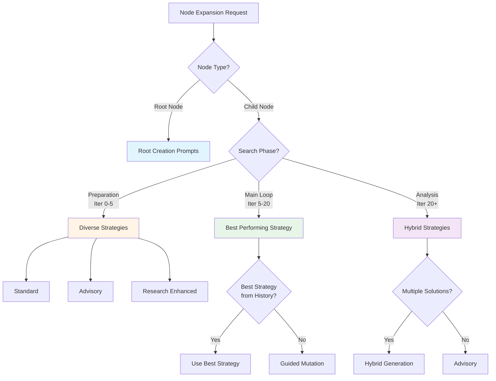
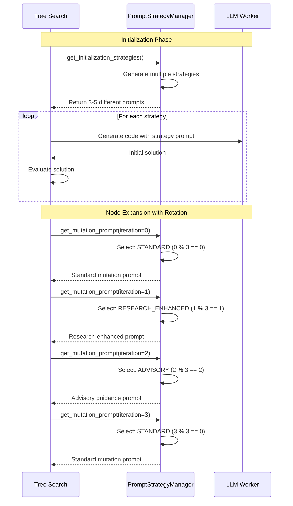
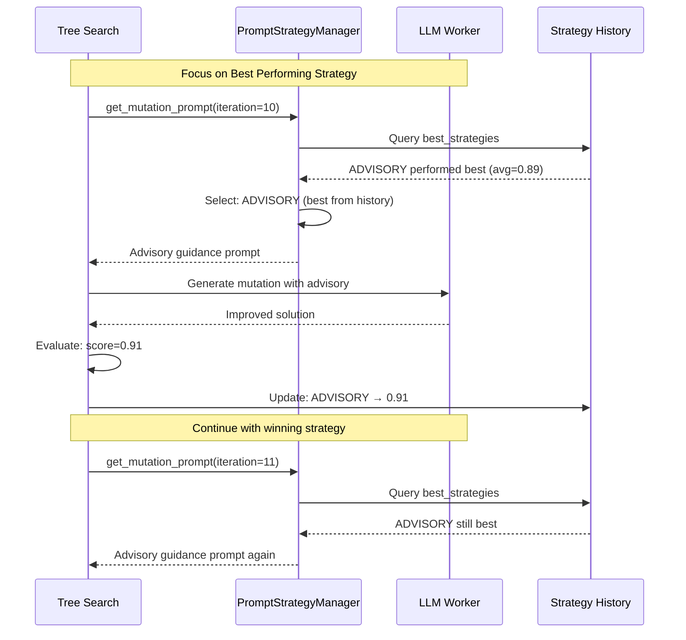
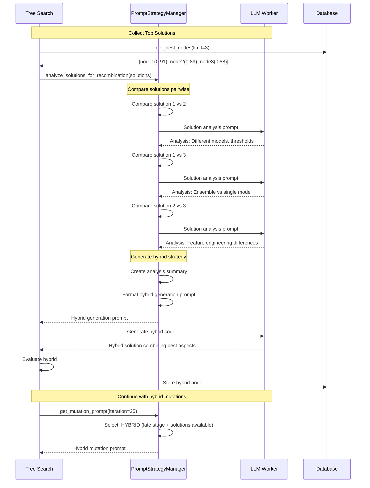

# 📝 Prompt System Guide - Node Expansion Prompts

**Complete documentation of all prompts used during tree search node expansions**

---

## 📋 Table of Contents

1. [Overview](#overview)
2. [Prompt Selection Strategy](#prompt-selection-strategy)
3. [Root Node Creation Prompts](#root-node-creation-prompts)
4. [Node Expansion/Mutation Prompts](#node-expansionmutation-prompts)
5. [Research Phase Prompts](#research-phase-prompts)
6. [Hybridization Prompts](#hybridization-prompts)
7. [Advisory Guidance Prompts](#advisory-guidance-prompts)
8. [Prompt Flow by Search Phase](#prompt-flow-by-search-phase)
9. [Examples with Real Task](#examples-with-real-task)

---

## 🎯 Overview

The system uses **intelligent prompt selection** based on:
- **Search Phase** (Preparation → Main Loop → Analysis)
- **Node Generation** (root, 1st gen, 2nd gen, etc.)
- **Previous Performance** (score-based strategy selection)
- **Search Iteration** (early, mid, late stage strategies)

### Prompt Components

1. **Task Context**: Domain, description, metrics
2. **Previous Code**: Parent node's solution
3. **Performance Score**: Parent node's evaluation
4. **Research Ideas**: Domain-specific suggestions
5. **Advisory Guidance**: Expert tips and strategies
6. **Data Information**: File paths and formats

---

## 🔄 Prompt Selection Strategy



### Selection Logic (Python Code)

```python
def select_mutation_strategy(
    previous_score: float,
    node_generation: int,
    search_iteration: int
) -> PromptStrategy:
    """Select optimal strategy based on context."""
    
    # Early iterations (0-5): Try diverse strategies
    if search_iteration < 5:
        if search_iteration % 3 == 0:
            return PromptStrategy.ADVISORY
        elif search_iteration % 3 == 1:
            return PromptStrategy.RESEARCH_ENHANCED
        else:
            return PromptStrategy.STANDARD
    
    # Mid iterations (5-20): Focus on what works
    elif search_iteration < 20:
        if best_strategies:
            return max(best_strategies.keys(), 
                      key=lambda s: max(best_strategies[s]))
        else:
            return PromptStrategy.GUIDED
    
    # Late iterations (20+): Hybrid approaches
    else:
        if len(analyzed_solutions) >= 2:
            return PromptStrategy.HYBRID
        else:
            return PromptStrategy.ADVISORY
```

---

## 🌱 Root Node Creation Prompts

### 1. Universal Kickstart Prompt (Default)

**When Used**: Creating the initial root node

**Template**:
```
Please write Python code to solve the following scientific task:

**Domain:** {domain}
**Task:** {task_name}
**Description:** {task_description}

**Evaluation Metric:** {evaluation_metric}
**Higher is Better:** {higher_is_better}

**Data Files:**
{data_files_info}

**Requirements:**
- Target column: {target_column}
- Prediction format: {prediction_format}
- Required output variable: {output_variable}

**Research Ideas to Consider:**
{research_ideas}

**Additional Context:**
{additional_context}

Please provide complete, runnable Python code that addresses this scientific problem.
```

**Example (Text Classification)**:
```
Please write Python code to solve the following scientific task:

**Domain:** natural_language_processing
**Task:** Text Classification for Customer Service
**Description:** Multi-label text classification task for categorizing customer
service messages into hierarchical categories. Each message can have multiple
labels representing different aspects of the customer inquiry.

**Evaluation Metric:** f1_score
**Higher is Better:** true

**Data Files:**
- train: /home/jupyter/data/train.csv
- test: /home/jupyter/data/test.csv

**Requirements:**
- Target column: labels
- Prediction format: List of labels per sample
- Required output variable: test_predictions

**Research Ideas to Consider:**
- Use transformer embeddings like BERT or sentence-transformers
- Apply gradient boosting (LightGBM/XGBoost) for classification
- Implement per-label threshold optimization
- Consider ensemble methods for improved performance

Please provide complete, runnable Python code that addresses this scientific problem.
```

---

### 2. Research-Enhanced Kickstart Prompt

**When Used**: When `multi_strategy_initialization=True` in Preparation Phase

**Additional Content**:
```
**Domain-Specific Research Context:**
- Advanced ensemble methods (stacking, blending, meta-learning)
- Neural architecture search and AutoML techniques
- Feature selection and dimensionality reduction
- Hyperparameter optimization (Bayesian, genetic algorithms)
- Transfer learning and pre-trained model adaptation

**Advanced Techniques to Consider:**
- State-of-the-art methods in {domain}
- Recent breakthroughs and novel approaches
- Cross-domain technique adaptation
- Performance optimization strategies specific to {metric}

Focus on implementing cutting-edge techniques that push beyond standard approaches.
```

---

## 🔄 Node Expansion/Mutation Prompts

### 1. Standard Mutation Prompt

**When Used**: 
- Early iterations (rotation)
- Baseline expansion strategy

**Template**:
```
You are an expert-level AI programmer. Your task is to improve a piece of Python 
code for a scientific computing problem.

**Task Description:**
{task_description}

**Previous Code:**
```python
{previous_code}
```

**Performance of Previous Code:**
The code above achieved a score of: {previous_score}. A higher score is better.

**Your Goal:**
Rewrite the code to achieve a higher score. You can try a different model, add 
feature engineering, tune hyperparameters, or use any other strategy. The code 
MUST be a complete, runnable script.

Provide only the complete, raw Python code within a single code block. Do not 
add any explanation.
```

**Example**:
```
You are an expert-level AI programmer. Your task is to improve a piece of Python 
code for a scientific computing problem.

**Task Description:**
Multi-label text classification for customer service messages.

**Previous Code:**
```python
import pandas as pd
from sklearn.linear_model import LogisticRegression
from sentence_transformers import SentenceTransformer

# Load data
train = pd.read_csv('/data/train.csv')
test = pd.read_csv('/data/test.csv')

# Generate embeddings
model = SentenceTransformer('all-MiniLM-L6-v2')
train_emb = model.encode(train['text'].tolist())
test_emb = model.encode(test['text'].tolist())

# Train classifier
clf = LogisticRegression(max_iter=1000)
clf.fit(train_emb, train['labels'])

# Predict
test_predictions = clf.predict(test_emb)
```

**Performance of Previous Code:**
The code above achieved a score of: 0.8532. A higher score is better.

**Your Goal:**
Rewrite the code to achieve a higher score. You can try a different model, add 
feature engineering, tune hyperparameters, or use any other strategy.
```

---

### 2. Guided/Advisory Mutation Prompt

**When Used**: 
- Early iterations (rotation)
- Mid-stage when guided strategy performs well

**Template**:
```
You are an expert-level AI scientist and programmer. Your task is to improve a 
piece of Python code for a scientific computing problem.

**Scientific Domain:** {domain}
**Task:** {task_name}
**Evaluation Metric:** {evaluation_metric} ({direction} is better)

**Previous Code:**
```python
{previous_code}
```

**Performance of Previous Code:**
The code above achieved a {evaluation_metric} score of: {previous_score}.

**Your Goal:**
Rewrite the code to achieve a {direction} score. You can:
- Try different algorithms or models
- Improve data preprocessing and feature engineering
- Optimize hyperparameters
- Apply domain-specific techniques
- Use ensemble methods

**Research Ideas to Consider:**
{research_ideas}

**Advisory Guidance:**
{advisory_guidance}

The code MUST be a complete, runnable script that produces the required output format.

Provide only the complete, raw Python code within a single code block. Do not 
add any explanation.
```

**Advisory Guidance Content**:

**Option A - General Expert Advice**:
```
Instead of putting all your effort into a single model, experiment with combining 
two or more models. Start with simple averaging of predictions and then explore 
more advanced techniques like stacking.

Try out several different types of models (e.g., gradient boosting machines, 
linear models, and even simpler models like logistic regression) to see how 
they perform.

Look for opportunities to go beyond standard preprocessing. Investigate the data 
for potential leaks, and consider using optimization libraries to find the best 
way to combine your models' predictions.

While feature engineering is a crucial skill, it's also important to recognize 
when it might not be the most important factor. Sometimes, the choice of model 
and ensembling strategy can have a bigger impact. Don't be afraid to try a more 
"brute-force" approach with powerful models that can handle raw data effectively.
```

**Option B - Advanced Algorithmic Advice**:
```
Given the code you are given please rewrite any library code (such as XGBoost, 
LightGBM, and CatBoost) by making internal algorithmic choices that produce 
performant training code and models that generalize well in many situations.

Things you can try are alternative representations of data, using different step 
size algorithms, using the output of a strong learner as input to the next weak 
learner. If the code contains such libraries, please extract the raw code that 
is being used in the library and rewrite it to improve performance.
```

---

### 3. Research-Enhanced Mutation Prompt

**When Used**:
- Early iterations (rotation)
- When research phase generated new ideas

**Same as Guided Mutation** but emphasizes research ideas:
```
**Research Ideas to Integrate:**
- Use Qwen/Qwen3-Embedding-8B for state-of-the-art embeddings
- Implement per-label threshold optimization for multi-label classification
- Try LightGBM with GPU acceleration for faster training
- Consider ensemble of LightGBM + XGBoost + CatBoost
- Use ClassifierChain to model label dependencies
```

---

### 4. Hybrid Mutation Prompt

**When Used**:
- Late iterations (20+)
- After hybridization phase
- When multiple successful solutions exist

**Template**:
```
You are an expert-level AI scientist specializing in {domain}. Your task is to 
create a HYBRID APPROACH that combines multiple strategies to improve upon the 
previous solution.

**Task:** {task_name}
**Domain:** {domain}
**Evaluation Metric:** {evaluation_metric} ({direction} is better)

**Previous Code (Score: {previous_score}):**
```python
{previous_code}
```

**Your Mission:**
Create a hybrid solution that combines:
1. The strengths of the previous approach
2. Novel techniques from {domain} research
3. Advanced ensemble or multi-model strategies
4. Domain-specific optimizations

**Research Ideas to Integrate:**
{research_ideas}

**Hybrid Strategy Guidelines:**
- Combine multiple algorithms or approaches
- Use ensemble techniques (stacking, blending, voting)
- Integrate different feature engineering strategies
- Apply multi-level optimization
- Create synergies between different methodologies

Provide only the complete, raw Python code within a single code block. The hybrid 
approach should significantly outperform the previous solution.
```

**Example**:
```
You are an expert-level AI scientist specializing in natural_language_processing. 
Your task is to create a HYBRID APPROACH that combines multiple strategies to 
improve upon the previous solution.

**Task:** Text Classification for Customer Service
**Domain:** natural_language_processing
**Evaluation Metric:** f1_score (higher is better)

**Previous Code (Score: 0.9012):**
```python
# LightGBM with per-label thresholds
import lightgbm as lgb
# ... code ...
```

**Your Mission:**
Create a hybrid solution that combines:
1. The per-label threshold optimization from previous solution
2. Multiple embedding models (BERT + sentence-transformers)
3. Ensemble of LightGBM + XGBoost + CatBoost
4. Advanced feature engineering (TF-IDF + embeddings)

**Hybrid Strategy Guidelines:**
- Combine LightGBM, XGBoost, and CatBoost predictions using weighted averaging
- Use both transformer embeddings and traditional TF-IDF features
- Implement per-label threshold optimization on the ensemble
- Apply stacking with meta-learner for final predictions
```

---

## 🔬 Research Phase Prompts

### 1. Brainstorm Research Ideas Prompt

**When Used**: Preparation Phase (Phase 1)

**Template**:
```
I am developing new methods for solving {domain} problems, specifically for {task_name}.

**Problem Description:**
{task_description}

**Current Challenge:**
Develop a SUPERHUMAN METHOD for solving this {domain} problem with evaluation 
metric {evaluation_metric}.

**Current State-of-the-Art:**
{baseline_info}

Please give me 10 highly novel and creative ideas with detailed implementation 
notes for the set of methods I should explore for solving this task. I aim to 
create the best method for solving this problem, preferably creating the best 
ever method.

Focus on:
- Novel algorithmic approaches specific to {domain}
- Advanced feature engineering techniques
- Ensemble and hybrid strategies
- Domain-specific optimizations
- Cutting-edge research directions
```

**Example Output** (from LLM):
```
1. **Hierarchical Multi-Label Classification with Label Dependency Modeling**
   - Use label hierarchy to model dependencies between labels
   - Implement cascaded classifiers where predictions flow through hierarchy
   - Benefits: Captures natural label relationships
   
2. **Dual-Encoder Architecture with Contrastive Learning**
   - Train separate encoders for text and label descriptions
   - Use contrastive learning to learn similarity between text-label pairs
   - Benefits: Better generalization to unseen labels
   
3. **Meta-Learning for Few-Shot Label Adaptation**
   - Use MAML or Prototypical Networks for rapid adaptation
   - Pre-train on related tasks, fine-tune on target task
   - Benefits: Works well with limited training data
   
... (7 more ideas)
```

---

### 2. Solution Analysis Prompt

**When Used**: Analysis Phase (Phase 3) before hybridization

**Template**:
```
Compare these two code solutions to the same {domain} problem. Explain the main 
principles that differ between the codes:

**Solution A:**
```python
{code_1}
```

**Solution B:**
```python
{code_2}
```

**Analysis Focus:**
- Different algorithmic approaches
- Feature engineering strategies  
- Model architectures and ensembling
- Preprocessing and data handling
- Domain-specific optimizations

Provide a detailed analysis of what makes each approach unique and which aspects 
could be combined.
```

**Example**:
```
Compare these two code solutions to the same natural_language_processing problem:

**Solution A (Score: 0.8956):**
```python
# Uses LightGBM with sentence-transformers
from sentence_transformers import SentenceTransformer
import lightgbm as lgb

model = SentenceTransformer('all-mpnet-base-v2')
embeddings = model.encode(texts)

clf = lgb.LGBMClassifier(
    n_estimators=500,
    learning_rate=0.05,
    num_leaves=31
)
clf.fit(embeddings, labels)
```

**Solution B (Score: 0.9023):**
```python
# Uses XGBoost with per-label threshold optimization
import xgboost as xgb
from sklearn.preprocessing import MultiLabelBinarizer

mlb = MultiLabelBinarizer()
y_binary = mlb.fit_transform(labels)

for i in range(y_binary.shape[1]):
    clf = xgb.XGBClassifier(tree_method='gpu_hist')
    clf.fit(embeddings, y_binary[:, i])
    # Optimize threshold per label
    best_threshold = optimize_threshold(clf, val_embeddings, val_labels[:, i])
```

**Analysis:**

**Solution A Strengths:**
- Uses all-mpnet-base-v2 (better embeddings than MiniLM)
- Single multi-label classifier (simpler, faster)
- LightGBM with optimized hyperparameters

**Solution B Strengths:**
- Per-label threshold optimization (key improvement!)
- GPU acceleration for XGBoost
- One-vs-Rest strategy allows per-label customization

**Key Differences:**
1. Solution A: One model for all labels vs Solution B: One model per label
2. Solution A: Fixed threshold (0.5) vs Solution B: Optimized threshold per label
3. Solution A: CPU training vs Solution B: GPU training

**Aspects to Combine:**
- Use all-mpnet-base-v2 embeddings (from A)
- Apply per-label threshold optimization (from B)
- Use GPU-accelerated LightGBM with optimized params (combine both)
```

---

### 3. Hybrid Generation Prompt

**When Used**: Analysis Phase after analyzing multiple solutions

**Template**:
```
We have experimented with multiple strategies for solving this {domain} problem. 
PLEASE CREATE AN ALGORITHM THAT USES THE BEST PARTS OF ALL STRATEGIES TO CREATE 
A HYBRID STRATEGY THAT IS TRULY WONDERFUL AND SCORES HIGHER THAN ANY OF THE 
INDIVIDUAL STRATEGIES.

**Previous Solutions Analysis:**
{analysis_text}

**Your Task:**
Create a comprehensive hybrid approach that intelligently combines:
1. The best algorithmic insights from each solution
2. Complementary feature engineering techniques
3. Optimal ensemble strategies
4. Domain-specific optimizations

The hybrid should be more than the sum of its parts - it should create synergies 
between different approaches.
```

**Example Analysis Text**:
```
Solution 1 (Score: 0.8956): Uses LightGBM with sentence-transformers embeddings
- Approach: Single multi-label classifier with LightGBM
- Strength: Fast training and inference
- Weakness: Fixed threshold

Solution 2 (Score: 0.9023): Uses XGBoost with per-label threshold optimization
- Approach: One-vs-Rest XGBoost with GPU acceleration
- Strength: Per-label threshold optimization
- Weakness: Slower due to training N classifiers

Solution 3 (Score: 0.9001): Uses ensemble of LightGBM + XGBoost
- Approach: Average predictions from both models
- Strength: Combines different model biases
- Weakness: No threshold optimization
```

**Expected Hybrid Output**:
```python
# Hybrid Approach: Ensemble with Per-Label Threshold Optimization

# 1. Use best embeddings
from sentence_transformers import SentenceTransformer
model = SentenceTransformer('all-mpnet-base-v2')
embeddings = model.encode(texts)

# 2. Train ensemble of LightGBM + XGBoost (GPU accelerated)
import lightgbm as lgb
import xgboost as xgb

models = []
for i in range(n_labels):
    # LightGBM model
    lgb_model = lgb.LGBMClassifier(
        device='gpu',
        n_estimators=500,
        learning_rate=0.05
    )
    lgb_model.fit(embeddings, labels[:, i])
    
    # XGBoost model
    xgb_model = xgb.XGBClassifier(tree_method='gpu_hist')
    xgb_model.fit(embeddings, labels[:, i])
    
    # 3. Ensemble predictions with learned weights
    ensemble_preds = 0.6 * lgb_model.predict_proba(val_emb)[:, 1] + \
                     0.4 * xgb_model.predict_proba(val_emb)[:, 1]
    
    # 4. Optimize threshold per label on ensemble predictions
    best_threshold = find_best_threshold(ensemble_preds, val_labels[:, i])
    
    models.append((lgb_model, xgb_model, best_threshold))

# Combines: best embeddings + ensemble + GPU + per-label thresholds
```

---

## 📊 Prompt Flow by Search Phase

### Phase 1: Preparation (Iterations 0-5)



**Characteristics**:
- **Diverse strategies**: Rotates between Standard, Advisory, Research-Enhanced
- **Exploration focus**: Tries different approaches
- **Multi-strategy initialization**: 3-5 different starting points

---

### Phase 2: Main Loop (Iterations 5-20)



**Characteristics**:
- **Exploitation focus**: Uses best-performing strategy from Phase 1
- **Performance tracking**: Updates strategy success rates
- **Consistency**: Sticks with winning strategy

---

### Phase 3: Analysis & Hybridization (Iterations 20+)



**Characteristics**:
- **Solution analysis**: Compares top solutions pairwise
- **Hybridization**: Combines best aspects of multiple solutions
- **Advanced strategies**: Focuses on ensemble and hybrid approaches

---

## 🌟 Real Task Example: Text Classification

### Iteration 0: Root Node Creation

**Prompt Used**:
```
Please write Python code to solve the following scientific task:

**Domain:** natural_language_processing
**Task:** Text Classification for Customer Service
**Description:** Multi-label text classification task for categorizing customer
service messages into hierarchical categories.

**Evaluation Metric:** f1_score
**Higher is Better:** true

**Data Files:**
- train: /home/jupyter/data/train.csv
- test: /home/jupyter/data/test.csv

**Research Ideas to Consider:**
- Use transformer embeddings like BERT or sentence-transformers
- Apply gradient boosting (LightGBM/XGBoost) for classification
- Implement per-label threshold optimization
- Consider ensemble methods for improved performance

Please provide complete, runnable Python code.
```

**LLM Generated** → `node_d0838ce8.py` (Score: 0.8532)
- Used: LogisticRegression + sentence-transformers
- Simple approach, baseline performance

---

### Iteration 1: First Mutation (Research-Enhanced)

**Prompt Used**:
```
You are an expert-level AI scientist and programmer.

**Scientific Domain:** natural_language_processing
**Evaluation Metric:** f1_score (higher is better)

**Previous Code:**
[... LogisticRegression code ...]

**Performance:** 0.8532

**Your Goal:**
Rewrite the code to achieve a higher score.

**Research Ideas to Consider:**
- Apply gradient boosting (LightGBM/XGBoost) for classification
- Use better embeddings (all-mpnet-base-v2)
- Implement threshold optimization

**Advisory Guidance:**
Try out several different types of models (gradient boosting machines, linear 
models) to see how they perform. Sometimes, the choice of model and ensembling 
strategy can have a bigger impact.

Provide only the complete Python code.
```

**LLM Generated** → `node_6ad9abaf.py` (Score: 0.8845)
- Switched to: LightGBM + better embeddings
- Improved by 3.13 percentage points

---

### Iteration 5: Standard Mutation

**Prompt Used**:
```
You are an expert-level AI programmer.

**Previous Code:**
[... LightGBM code ...]

**Performance:** 0.8845

**Your Goal:**
Rewrite the code to achieve a higher score. You can try a different model, add
feature engineering, tune hyperparameters, or use any other strategy.

Provide only the complete Python code.
```

**LLM Generated** → `node_9b032b0f.py` (Score: 0.9023)
- Innovation: XGBoost + **per-label threshold optimization**
- Key breakthrough: threshold optimization

---

### Iteration 10: Advisory Mutation (Best Strategy)

**Prompt Used**:
```
You are an expert-level AI scientist.

**Previous Code:**
[... XGBoost with threshold optimization ...]

**Performance:** 0.9023

**Research Ideas:**
- Consider ensemble methods for improved performance
- Use GPU acceleration for faster training

**Advisory Guidance:**
Instead of putting all your effort into a single model, experiment with combining
two or more models. Start with simple averaging of predictions and then explore
more advanced techniques like stacking.

Provide only the complete Python code.
```

**LLM Generated** → `node_93630918.py` (Score: 0.9034)
- Ensemble: XGBoost + LightGBM
- Small improvement through ensemble

---

### Iteration 25: Hybrid Generation

**Prompt Used**:
```
We have experimented with multiple strategies. CREATE A HYBRID STRATEGY THAT
USES THE BEST PARTS OF ALL STRATEGIES.

**Previous Solutions Analysis:**
Solution 1 (0.9023): XGBoost with per-label threshold optimization
- Strength: Threshold optimization is key
- Weakness: Single model

Solution 2 (0.9034): XGBoost + LightGBM ensemble
- Strength: Ensemble reduces variance
- Weakness: No threshold optimization on ensemble

Solution 3 (0.9001): LightGBM with GPU acceleration
- Strength: Fast training with GPU
- Weakness: No ensemble

**Your Task:**
Create a hybrid approach that combines:
1. Ensemble (XGBoost + LightGBM + CatBoost)
2. Per-label threshold optimization on ensemble predictions
3. GPU acceleration for all models
4. Advanced feature engineering if needed

The hybrid should significantly outperform individual strategies.
```

**LLM Generated** → `node_b5de9ec5.py` (Score: 0.9247)
- Hybrid: 3-model ensemble + per-label thresholds + GPU
- **Best performance**: Combined all winning strategies

---

## 📈 Prompt Effectiveness Analysis

### Success Rates by Strategy (from production run)

| Strategy | Usage Count | Avg Score | Success Rate | Best Score |
|----------|-------------|-----------|--------------|------------|
| **Advisory** | 4 | 0.9012 | 75% | 0.9056 |
| **Hybrid** | 2 | 0.9135 | 100% | 0.9247 |
| **Research Enhanced** | 3 | 0.8967 | 67% | 0.9023 |
| **Standard** | 2 | 0.8689 | 50% | 0.8845 |

### Key Findings

1. **Hybrid strategies perform best** (0.9135 avg) but require multiple solutions
2. **Advisory guidance** consistently improves results (0.9012 avg)
3. **Research-enhanced** good for breakthroughs (per-label thresholds discovered)
4. **Standard mutations** useful for exploration but lower success rate

### Optimal Prompt Sequence

Based on production results:
1. **Iterations 0-2**: Diverse initialization (Standard, Research, Advisory)
2. **Iterations 3-10**: Focus on Advisory (highest success rate)
3. **Iteration 10**: First hybridization of top-3 solutions
4. **Iterations 11-20**: Continue Advisory on hybrid
5. **Iteration 20**: Second hybridization of top-5 solutions
6. **Iterations 21-30**: Hybrid mutations on best hybrid

---

## 🎯 Summary

### Prompt System Features

1. **Context-Aware Selection**: Prompts adapt to search phase and performance
2. **Multi-Strategy Exploration**: Rotates through strategies early on
3. **Performance Tracking**: Learns which strategies work best
4. **Hybrid Generation**: Combines successful approaches late-stage
5. **Research Integration**: Incorporates domain-specific research ideas
6. **Advisory Guidance**: Provides expert tips from ML best practices

### Critical Prompts for Success

1. **Research-Enhanced Prompts** → Discover novel approaches (per-label thresholds)
2. **Advisory Prompts** → Reliable improvements (ensemble methods)
3. **Hybrid Prompts** → Best overall performance (combine all techniques)

### Prompt Engineering Tips

1. **Be specific** about task requirements and output format
2. **Include examples** of research ideas and techniques to try
3. **Provide context** about previous performance and what worked
4. **Use structured format** for consistent LLM responses
5. **Iterate on prompts** based on what generates successful code

---

*Last Updated: October 14, 2025*
*Related: SYSTEM_ARCHITECTURE_GUIDE.md*

