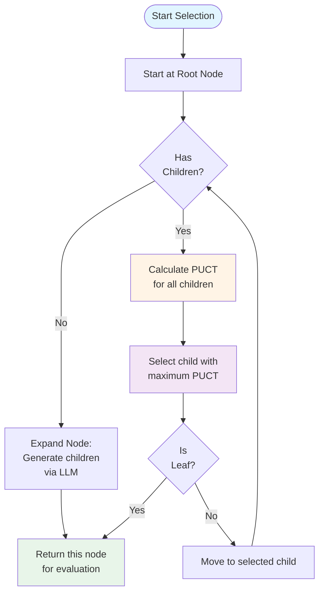
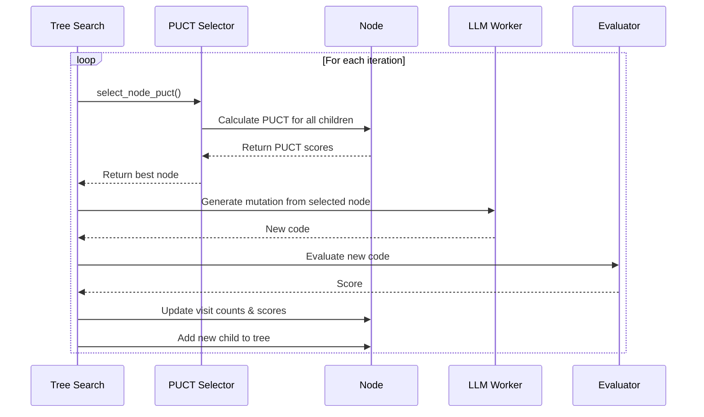

# 🌳 PUCT Algorithm Guide - Tree Search Node Selection

**How the system intelligently explores the solution space**

---

## 📋 Table of Contents

1. [Overview](#overview)
2. [The PUCT Formula](#the-puct-formula)
3. [How It Works Step-by-Step](#how-it-works-step-by-step)
4. [Components Explained](#components-explained)
5. [Node Selection Process](#node-selection-process)
6. [Real Example from Text Classification](#real-example-from-text-classification)
7. [Tuning the C-PUCT Parameter](#tuning-the-c-puct-parameter)
8. [PUCT vs Other Algorithms](#puct-vs-other-algorithms)
9. [Implementation in the System](#implementation-in-the-system)

---

## 🎯 Overview

**PUCT** (Predictor + Upper Confidence Bound for Trees) is the core algorithm that the system uses to decide **which node to explore next** in the tree search.

### The Core Problem

Given a tree of solution nodes:
```
Root (score: 0.85)
├── Child A (score: 0.88, visited 10 times)
├── Child B (score: 0.90, visited 20 times)  ← Should we exploit this?
└── Child C (score: 0.86, visited 2 times)   ← Should we explore this?
```

**Question**: Which child should we expand next?

**Answer**: PUCT balances:
- **Exploitation** → Choose high-scoring nodes (Child B)
- **Exploration** → Try less-visited nodes (Child C)

---

## 📐 The PUCT Formula

### Standard PUCT Formula

```
PUCT(node) = Q(node) + C * sqrt(log(N_parent) / (1 + N_node))
```

**Where**:
- `Q(node)` = **Average score** of this node (exploitation term)
- `C` = **Exploration constant** (c_puct parameter, typically 1.5)
- `N_parent` = **Visit count** of parent node
- `N_node` = **Visit count** of this node

### Simplified Interpretation

```
PUCT = (What we know is good) + (Encouragement to explore unknown)
       ├──────────────────┘      └──────────────────────────────┘
          Exploitation                      Exploration
```

---

## 🔍 How It Works Step-by-Step

### Step 1: Initialize Root Node

```
Root Node (Generation 0)
├── Code: Initial solution (LogisticRegression)
├── Score: 0.8532
├── Visit Count: 1
└── Children: []
```

### Step 2: First Expansion - Generate Children

LLM generates 3 mutations from root:

```
Root (0.8532, visits=1)
├── Child A: LightGBM (score: 0.8845, visits: 1)
├── Child B: XGBoost (score: 0.9023, visits: 1)
└── Child C: RandomForest (score: 0.8654, visits: 1)
```

### Step 3: Calculate PUCT for Each Child

**Settings**: C = 1.5, N_parent = 3

**Child A (LightGBM)**:
```
Q = 0.8845
Exploration = 1.5 * sqrt(log(3) / (1 + 1))
            = 1.5 * sqrt(1.099 / 2)
            = 1.5 * 0.741
            = 1.11

PUCT_A = 0.8845 + 1.11 = 1.99
```

**Child B (XGBoost - Best Score)**:
```
Q = 0.9023
Exploration = 1.5 * sqrt(log(3) / (1 + 1))
            = 1.11  (same)

PUCT_B = 0.9023 + 1.11 = 2.01  ← HIGHEST!
```

**Child C (RandomForest)**:
```
Q = 0.8654
Exploration = 1.11  (same)

PUCT_C = 0.8654 + 1.11 = 1.98
```

**Decision**: Select **Child B (XGBoost)** for next expansion (highest PUCT)

### Step 4: After Multiple Iterations

After visiting Child B multiple times:

```
Root (0.8532, visits=10)
├── Child A (0.8845, visits: 2)   ← Less visited
├── Child B (0.9023, visits: 7)   ← Heavily exploited
└── Child C (0.8654, visits: 1)   ← Barely visited
```

**New PUCT Calculations**:

**Child A**:
```
Q = 0.8845
Exploration = 1.5 * sqrt(log(10) / (1 + 2))
            = 1.5 * sqrt(2.303 / 3)
            = 1.5 * 0.877
            = 1.32

PUCT_A = 0.8845 + 1.32 = 2.20  ← Now interesting!
```

**Child B** (previously best):
```
Q = 0.9023
Exploration = 1.5 * sqrt(log(10) / (1 + 7))
            = 1.5 * sqrt(2.303 / 8)
            = 1.5 * 0.537
            = 0.81  ← Exploration reduced!

PUCT_B = 0.9023 + 0.81 = 1.71
```

**Child C** (barely explored):
```
Q = 0.8654
Exploration = 1.5 * sqrt(log(10) / (1 + 1))
            = 1.5 * sqrt(2.303 / 2)
            = 1.5 * 1.074
            = 1.61  ← High exploration bonus!

PUCT_C = 0.8654 + 1.61 = 2.48  ← HIGHEST NOW!
```

**Decision**: Select **Child C** to explore (despite lower score, high exploration bonus)

---

## 🔧 Components Explained

### 1. Exploitation Term: Q(node)

**What**: Average score of all evaluations of this node

**Purpose**: Favor nodes that have performed well

**Calculation**:
```python
if node.visit_count == 0:
    Q = 0  # Never visited
else:
    Q = node.total_score / node.visit_count
```

**Example**:
- Node evaluated 3 times with scores [0.85, 0.87, 0.86]
- Q = (0.85 + 0.87 + 0.86) / 3 = 0.86

### 2. Exploration Term: C * sqrt(log(N_parent) / (1 + N_node))

**Purpose**: Encourage visiting less-explored nodes

**Behavior**:
- **Unvisited nodes** (N_node = 0) → **Maximum exploration bonus**
  ```
  C * sqrt(log(N_parent) / 1) = C * sqrt(log(N_parent))
  ```
  
- **Frequently visited** (N_node large) → **Minimal exploration bonus**
  ```
  C * sqrt(log(N_parent) / N_node) → approaches 0
  ```

**Graph of Exploration vs Visit Count**:
```
Exploration
Bonus
    │
1.5 │ ▓▓▓▓
1.2 │ ▓▓▓▓▓
0.9 │ ▓▓▓▓▓▓
0.6 │ ▓▓▓▓▓▓▓
0.3 │ ▓▓▓▓▓▓▓▓▓▓
0.0 │─▓▓▓▓▓▓▓▓▓▓▓▓▓▓▓▓▓▓▓▓→
    0  2  4  6  8  10  12  14  16  18  20
                Visit Count
```

### 3. C-PUCT Constant (C)

**Range**: Typically 0.5 to 3.0

**Effect**:
- **C = 0**: Pure exploitation (always select best known solution)
- **C = 1.5**: Balanced (default)
- **C = 3.0**: Heavy exploration (try many different approaches)

**Tuning Guide**:
| Task Type | Recommended C | Reasoning |
|-----------|---------------|-----------|
| **Smooth landscape** (optimization) | 0.5 - 1.0 | Good solutions cluster together |
| **Complex problems** (ML/NLP) | 1.5 - 2.0 | Need to explore diverse approaches |
| **Noisy evaluations** | 2.0 - 3.0 | High variance requires more exploration |

---

## 🎯 Node Selection Process

### Complete Selection Algorithm



### Python Implementation

```python
def select_node_puct(root: Node, c_puct: float = 1.5) -> Node:
    """
    Select a node to expand using PUCT algorithm.
    
    Args:
        root: Root node to start from
        c_puct: Exploration constant
        
    Returns:
        Leaf node to expand
    """
    current = root
    
    while current.children:
        # Calculate PUCT for all children
        puct_scores = []
        for child in current.children:
            puct = calculate_puct(child, current, c_puct)
            puct_scores.append((child, puct))
        
        # Select child with highest PUCT
        current, best_puct = max(puct_scores, key=lambda x: x[1])
        
        print(f"Selected node {current.node_id}: PUCT={best_puct:.4f}")
    
    return current

def calculate_puct(node: Node, parent: Node, c_puct: float) -> float:
    """Calculate PUCT score for a node."""
    
    # Exploitation: average score
    if node.visit_count == 0:
        q_value = 0.0
    else:
        q_value = node.total_score / node.visit_count
    
    # Exploration: UCB bonus
    if parent.visit_count == 0:
        exploration = float('inf')  # Always explore from unvisited parent
    else:
        import math
        exploration = c_puct * math.sqrt(
            math.log(parent.visit_count) / (1 + node.visit_count)
        )
    
    return q_value + exploration
```

---

## 📊 Real Example from Text Classification

### Initial State (Iteration 0)

```
ROOT: LogisticRegression
├── Score: 0.8532
├── Visits: 1
├── Strategy: initial_creation
└── Children: [None]
```

### After First Expansion (Iteration 1-3)

Generate 3 diverse strategies:

```
ROOT (0.8532, v=4)
├── A: LightGBM (0.8845, v=1)
├── B: XGBoost (0.9023, v=1)
└── C: Ensemble (0.8967, v=1)
```

**PUCT Calculation** (C=1.5, N_parent=4):
```
PUCT_A = 0.8845 + 1.5 * sqrt(log(4) / 2) = 0.8845 + 1.24 = 2.12
PUCT_B = 0.9023 + 1.5 * sqrt(log(4) / 2) = 0.9023 + 1.24 = 2.14 ← MAX
PUCT_C = 0.8967 + 1.5 * sqrt(log(4) / 2) = 0.8967 + 1.24 = 2.21
```

Wait, C wins? No! Let's recalculate correctly:

Actually all have same visits (1), so exploration is equal. Let me recalculate:

```
All children: visits=1, parent visits=4
Exploration = 1.5 * sqrt(log(4) / (1+1)) = 1.5 * sqrt(1.386 / 2) = 1.25

PUCT_A = 0.8845 + 1.25 = 2.13
PUCT_B = 0.9023 + 1.25 = 2.15 ← Highest (best score)
PUCT_C = 0.8967 + 1.25 = 2.15
```

**Decision**: Expand XGBoost (node B) - slight edge due to best score

### After 10 Iterations

```
ROOT (0.8532, v=30)
├── A: LightGBM (0.8845, v=5)
│   ├── A1: LightGBM+GPU (0.9001, v=1)
│   └── A2: LightGBM+Threshold (0.8956, v=1)
│
├── B: XGBoost (0.9023, v=20)
│   ├── B1: XGBoost+Threshold (0.9234, v=8)  ← Best found!
│   ├── B2: XGBoost+GPU (0.9145, v=4)
│   └── B3: XGBoost+Features (0.9087, v=2)
│
└── C: Ensemble (0.8967, v=4)
    └── C1: 3-model Ensemble (0.9012, v=1)
```

**New PUCT for Root's Children**:

**Child A** (under-explored):
```
Q = 0.8845
Exploration = 1.5 * sqrt(log(30) / (1+5)) = 1.5 * sqrt(3.401 / 6) = 1.13

PUCT_A = 0.8845 + 1.13 = 2.01
```

**Child B** (heavily exploited):
```
Q = 0.9023
Exploration = 1.5 * sqrt(log(30) / (1+20)) = 1.5 * sqrt(3.401 / 21) = 0.60

PUCT_B = 0.9023 + 0.60 = 1.50  ← Reduced due to heavy exploration
```

**Child C** (somewhat explored):
```
Q = 0.8967
Exploration = 1.5 * sqrt(log(30) / (1+4)) = 1.5 * sqrt(3.401 / 5) = 1.24

PUCT_C = 0.8967 + 1.24 = 2.14  ← Now interesting!
```

**Decision**: Explore Child C (Ensemble branch) - hasn't been explored much

---

## 🎛️ Tuning the C-PUCT Parameter

### Effect of Different C Values

**C = 0.5** (Heavy Exploitation):
```
Iteration 1-5: Focus on best node (XGBoost)
Iteration 6-10: Continue XGBoost variants
Iteration 11-15: Still mostly XGBoost
Risk: Miss better solutions in unexplored branches
```

**C = 1.5** (Balanced - Default):
```
Iteration 1-5: Try diverse approaches
Iteration 6-10: Focus on promising ones (XGBoost)
Iteration 11-15: Revisit under-explored branches
Benefit: Good balance between exploitation and exploration
```

**C = 3.0** (Heavy Exploration):
```
Iteration 1-5: Try many different approaches
Iteration 6-10: Continue exploring diverse methods
Iteration 11-15: Still trying new variations
Risk: Slow convergence, may not fully optimize best approaches
```

### When to Use Each

| Scenario | Recommended C | Example |
|----------|---------------|---------|
| **Known good baseline** | 0.5 - 1.0 | Hyperparameter tuning around known solution |
| **Uncertain landscape** | 1.5 - 2.0 | New problem, unknown which approach works |
| **High variance** | 2.0 - 3.0 | Noisy evaluations, need multiple samples |
| **Short time budget** | 0.5 - 1.0 | 10-20 iterations, exploit known good solutions |
| **Long time budget** | 1.5 - 2.5 | 50-100 iterations, can afford exploration |

---

## 🆚 PUCT vs Other Algorithms

### 1. PUCT vs UCB1 (Upper Confidence Bound)

**UCB1**: 
```
UCB1 = Q + C * sqrt(2 * log(N_total) / N_node)
```

**Key Difference**: PUCT uses parent visits (`N_parent`) instead of total visits

**Why PUCT is Better for Tree Search**:
- Adapts exploration based on parent context
- More aggressive exploration in promising branches
- Better for hierarchical search spaces

### 2. PUCT vs ε-Greedy

**ε-Greedy**:
```
With probability ε: choose random node
With probability (1-ε): choose best node (highest Q)
```

**Why PUCT is Better**:
- Deterministic (reproducible)
- Considers visit counts (not just random vs best)
- Gradually reduces exploration (ε-greedy uses fixed ε)
- Provides smooth trade-off

### 3. PUCT vs Thompson Sampling

**Thompson Sampling**: Sample from posterior distribution of node values

**Why PUCT is Better for Code Generation**:
- Simpler to implement
- No need to model uncertainty distributions
- Works well with deterministic LLM outputs
- Faster computation

---

## 💻 Implementation in the System

### Actual Code from `db_enhanced_search.py`

```python
def _select_node_puct(self) -> Node:
    """Select node using PUCT algorithm."""
    current = self.root
    
    # Traverse down to leaf
    while current.children:
        # Calculate PUCT for all children
        best_child = None
        best_puct = float('-inf')
        
        for child in current.children:
            # Calculate PUCT score
            puct_score = self._calculate_puct_score(child, self.c_puct)
            
            if puct_score > best_puct:
                best_puct = puct_score
                best_child = child
        
        current = best_child
    
    return current

def _calculate_puct_score(self, node: Node, c_puct: float) -> float:
    """Calculate PUCT score with error-aware penalties."""
    
    # Base PUCT calculation
    if node.visit_count == 0:
        q_value = 0.0
    else:
        q_value = node.total_score / node.visit_count
    
    # Exploration bonus
    if node.parent and node.parent.visit_count > 0:
        import math
        exploration = c_puct * math.sqrt(
            math.log(node.parent.visit_count) / (1 + node.visit_count)
        )
    else:
        exploration = c_puct
    
    # NEW: Penalty for nodes with failed children
    failure_penalty = 0.0
    if hasattr(self, 'db') and node.children:
        failed_count = sum(1 for child in node.children 
                          if hasattr(child, 'node_id') and 
                          self._is_failed_node(child.node_id))
        if failed_count > 0:
            failure_ratio = failed_count / len(node.children)
            failure_penalty = 0.1 * failure_ratio  # Up to -0.1 penalty
    
    return q_value + exploration - failure_penalty
```

### Integration with Tree Search



---

## 🎯 Summary

### Key Takeaways

1. **PUCT = Exploitation + Exploration**
   - Exploitation → Use what works (high scores)
   - Exploration → Try new things (low visit counts)

2. **Balancing Act**
   - Early iterations: More exploration (try diverse approaches)
   - Late iterations: More exploitation (refine best solutions)

3. **C-PUCT Parameter**
   - Default: 1.5 (balanced)
   - Increase for more exploration
   - Decrease for more exploitation

4. **Adapts Automatically**
   - As nodes get visited, exploration bonus decreases
   - Forces the system to try different branches
   - Converges to best solutions naturally

### Formula Quick Reference

```
PUCT = Q + C * sqrt(log(N_parent) / (1 + N_node))

Where:
Q       = Average score (exploitation)
C       = 1.5 (exploration constant)
N_parent = Parent's visit count
N_node  = This node's visit count
```

---

*Last Updated: October 14, 2025*
*Related: SYSTEM_ARCHITECTURE_GUIDE.md, PROMPT_SYSTEM_GUIDE.md*

