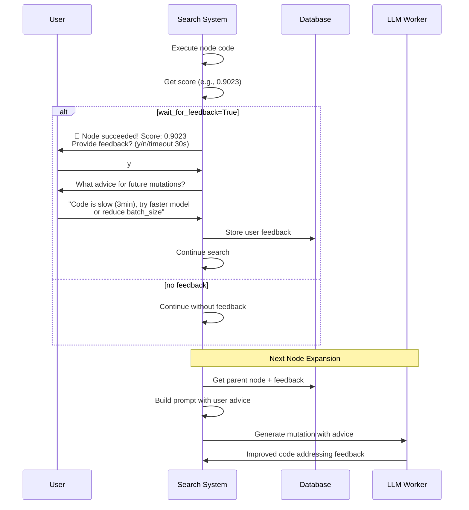
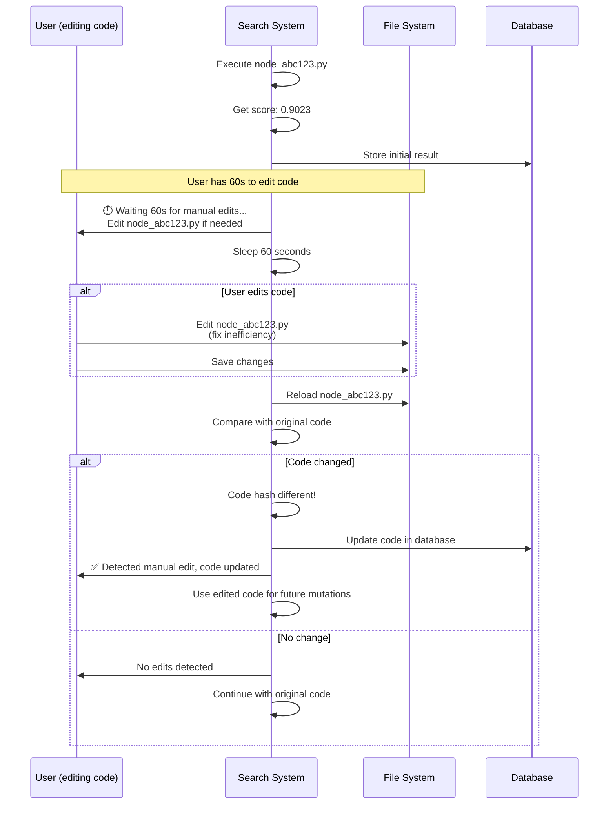

# 💬 User Feedback System - Interactive Node Improvement

**Enable manual feedback and code updates during tree search**

---

## 📋 Table of Contents

1. [Overview](#overview)
2. [Feature 1: User Advice for Node Expansion](#feature-1-user-advice-for-node-expansion)
3. [Feature 2: Code Reload After Scoring](#feature-2-code-reload-after-scoring)
4. [Implementation Guide](#implementation-guide)
5. [Usage Examples](#usage-examples)
6. [Database Schema Updates](#database-schema-updates)

---

## 🎯 Overview

### Requested Features

1. **User Advice Collection**: After a node executes successfully, allow the user to provide feedback like:
   - "Code runs but takes too long (5 minutes)"
   - "Good approach but try reducing batch size"
   - "This embedding model is overkill, use smaller one"
   - "Perfect! Try ensemble with this approach"

2. **Code Reload After Scoring**: After getting a score, reload the code file in case the user manually edited it during or after execution

### Benefits

- ✅ **Human-in-the-loop**: Incorporate domain expertise
- ✅ **Performance tuning**: Guide towards faster/better solutions
- ✅ **Manual corrections**: Fix small issues without full manual intervention
- ✅ **Learning feedback**: LLM learns from user's specific advice

---

## 📝 Feature 1: User Advice for Node Expansion

### System Design



---

### Implementation

#### 1. Database Schema Update

```sql
-- Add user feedback columns
ALTER TABLE execution_nodes ADD COLUMN user_feedback TEXT;
ALTER TABLE execution_nodes ADD COLUMN user_rating INTEGER; -- 1-5 stars
ALTER TABLE execution_nodes ADD COLUMN execution_time_seconds REAL;
ALTER TABLE execution_nodes ADD COLUMN user_approved BOOLEAN DEFAULT 1;

-- Create feedback history table
CREATE TABLE IF NOT EXISTS user_feedback (
    feedback_id TEXT PRIMARY KEY,
    node_id TEXT NOT NULL,
    feedback_text TEXT NOT NULL,
    feedback_type TEXT, -- 'performance', 'accuracy', 'approach', 'other'
    priority INTEGER DEFAULT 3, -- 1-5, higher = more important
    created_at TEXT DEFAULT CURRENT_TIMESTAMP,
    applied_to_nodes TEXT, -- Comma-separated node IDs that used this feedback
    FOREIGN KEY (node_id) REFERENCES execution_nodes (node_id)
);
```

#### 2. User Feedback Collector

**New file**: `core/utils/user_feedback_collector.py`

```python
"""
User Feedback Collector for Interactive Search
"""

import sys
import select
import time
from typing import Optional, Dict, Any
from dataclasses import dataclass
import uuid


@dataclass
class UserFeedback:
    """User feedback for a node."""
    feedback_id: str
    node_id: str
    feedback_text: str
    feedback_type: str
    priority: int = 3
    applied_to_nodes: list = None


class UserFeedbackCollector:
    """Collect user feedback during search."""
    
    def __init__(self, db_manager, enable_feedback: bool = True, timeout: int = 30):
        """
        Initialize feedback collector.
        
        Args:
            db_manager: DatabaseManager instance
            enable_feedback: Whether to enable feedback collection
            timeout: Timeout in seconds for user input
        """
        self.db = db_manager
        self.enable_feedback = enable_feedback
        self.timeout = timeout
        
        print(f"💬 User Feedback System initialized")
        print(f"   Enabled: {enable_feedback}")
        print(f"   Timeout: {timeout}s")
    
    def collect_feedback(
        self, 
        node_id: str, 
        score: float, 
        execution_time: float,
        code_snippet: str = ""
    ) -> Optional[UserFeedback]:
        """
        Collect user feedback for a node.
        
        Args:
            node_id: Node ID
            score: Performance score
            execution_time: Time taken to execute (seconds)
            code_snippet: First few lines of code for context
            
        Returns:
            UserFeedback object or None
        """
        if not self.enable_feedback:
            return None
        
        # Display node summary
        print("\n" + "=" * 70)
        print(f"✅ Node {node_id} completed successfully!")
        print(f"   📊 Score: {score:.4f}")
        print(f"   ⏱️  Execution time: {execution_time:.1f}s")
        
        if code_snippet:
            print(f"\n   📝 Code preview:")
            for line in code_snippet.split('\n')[:5]:
                print(f"      {line}")
        
        print("\n" + "=" * 70)
        
        # Ask if user wants to provide feedback
        print("\n💬 Do you want to provide feedback for future mutations? (y/n)")
        print(f"   [Timeout in {self.timeout}s, default: no]")
        print("   > ", end='', flush=True)
        
        # Wait for input with timeout
        response = self._get_input_with_timeout(self.timeout)
        
        if not response or response.lower() not in ['y', 'yes']:
            print("Continuing without feedback...")
            return None
        
        # Collect feedback details
        print("\n📝 Please provide your feedback/advice:")
        print("   (Examples: 'Too slow', 'Try smaller model', 'Good but optimize batch size')")
        print("   > ", end='', flush=True)
        
        feedback_text = self._get_input_with_timeout(60)  # Longer timeout
        
        if not feedback_text:
            print("No feedback provided, continuing...")
            return None
        
        # Categorize feedback
        print("\n📂 Feedback type:")
        print("   1. Performance (speed/memory)")
        print("   2. Accuracy (improve score)")
        print("   3. Approach (algorithm/method)")
        print("   4. Other")
        print("   Select (1-4) [default: 1]: ", end='', flush=True)
        
        type_input = self._get_input_with_timeout(10)
        feedback_type_map = {
            '1': 'performance',
            '2': 'accuracy',
            '3': 'approach',
            '4': 'other'
        }
        feedback_type = feedback_type_map.get(type_input, 'performance')
        
        # Priority
        print("\n⭐ Priority (1-5, higher = more important) [default: 3]: ", end='', flush=True)
        priority_input = self._get_input_with_timeout(5)
        try:
            priority = int(priority_input) if priority_input else 3
            priority = max(1, min(5, priority))
        except ValueError:
            priority = 3
        
        # Create feedback object
        feedback = UserFeedback(
            feedback_id=str(uuid.uuid4())[:8],
            node_id=node_id,
            feedback_text=feedback_text,
            feedback_type=feedback_type,
            priority=priority,
            applied_to_nodes=[]
        )
        
        # Store in database
        self._store_feedback(feedback)
        
        print(f"\n✅ Feedback recorded: {feedback_text}")
        print(f"   Type: {feedback_type}, Priority: {priority}\n")
        
        return feedback
    
    def _get_input_with_timeout(self, timeout: int) -> Optional[str]:
        """Get user input with timeout (Unix/Linux only)."""
        try:
            # For Unix/Linux systems
            if sys.platform != "win32":
                ready, _, _ = select.select([sys.stdin], [], [], timeout)
                if ready:
                    return sys.stdin.readline().strip()
                else:
                    print("  (timeout)")
                    return None
            else:
                # For Windows, use simple input (no timeout)
                # TODO: Implement Windows timeout using msvcrt
                return input().strip()
        except Exception as e:
            print(f"  (input error: {e})")
            return None
    
    def _store_feedback(self, feedback: UserFeedback):
        """Store feedback in database."""
        conn = self.db._get_connection()
        try:
            cursor = conn.cursor()
            
            # Update execution_nodes
            cursor.execute("""
                UPDATE execution_nodes
                SET user_feedback = ?
                WHERE node_id = ?
            """, (feedback.feedback_text, feedback.node_id))
            
            # Insert into user_feedback table
            cursor.execute("""
                INSERT INTO user_feedback (
                    feedback_id, node_id, feedback_text, 
                    feedback_type, priority
                )
                VALUES (?, ?, ?, ?, ?)
            """, (
                feedback.feedback_id,
                feedback.node_id,
                feedback.feedback_text,
                feedback.feedback_type,
                feedback.priority
            ))
            
            conn.commit()
        finally:
            conn.close()
    
    def get_feedback_for_lineage(self, node_id: str, max_depth: int = 5) -> list:
        """
        Get all user feedback from ancestor nodes.
        
        Args:
            node_id: Current node ID
            max_depth: Maximum ancestor depth to search
            
        Returns:
            List of UserFeedback objects
        """
        feedback_list = []
        current_id = node_id
        depth = 0
        
        conn = self.db._get_connection()
        try:
            cursor = conn.cursor()
            
            while current_id and depth < max_depth:
                # Get feedback for current node
                cursor.execute("""
                    SELECT 
                        feedback_id, node_id, feedback_text,
                        feedback_type, priority
                    FROM user_feedback
                    WHERE node_id = ?
                """, (current_id,))
                
                row = cursor.fetchone()
                if row:
                    feedback = UserFeedback(
                        feedback_id=row[0],
                        node_id=row[1],
                        feedback_text=row[2],
                        feedback_type=row[3],
                        priority=row[4]
                    )
                    feedback_list.append(feedback)
                
                # Get parent node ID
                cursor.execute("""
                    SELECT parent_id
                    FROM execution_nodes
                    WHERE node_id = ?
                """, (current_id,))
                
                parent_row = cursor.fetchone()
                current_id = parent_row[0] if parent_row else None
                depth += 1
        
        finally:
            conn.close()
        
        return feedback_list
```

#### 3. Integrate with Search System

**Modify `db_enhanced_search.py`**:

```python
from core.utils.user_feedback_collector import UserFeedbackCollector

class DatabaseEnhancedTreeSearch(EnhancedUniversalTreeSearch):
    def __init__(self, ...):
        # ... existing init ...
        
        # NEW: Initialize feedback collector
        self.feedback_collector = UserFeedbackCollector(
            self.db_evaluator.db,
            enable_feedback=self.db_config.enable_user_feedback,
            timeout=self.db_config.user_feedback_timeout
        )
    
    def _evaluate_and_update(self, node: Node, node_id: str) -> Dict[str, Any]:
        """Evaluate node and collect user feedback."""
        
        # Evaluate node
        start_time = time.time()
        result = self.db_evaluator.evaluate(
            code=node.code,
            parent_node_id=node.parent.node_id if node.parent else None,
            mutation_type=node.genealogy.mutation_type
        )
        execution_time = time.time() - start_time
        
        # If successful, collect user feedback
        if result['success'] and result.get('score'):
            # Get code snippet
            code_lines = node.code.split('\n')
            code_snippet = '\n'.join(code_lines[:10])
            
            # Collect feedback
            feedback = self.feedback_collector.collect_feedback(
                node_id=node_id,
                score=result['score'],
                execution_time=execution_time,
                code_snippet=code_snippet
            )
            
            # Store feedback reference in node
            if feedback:
                node.user_feedback = feedback.feedback_text
                node.user_feedback_priority = feedback.priority
        
        return result
```

#### 4. Integrate with LLM Prompts

**Modify `prompt_formatter.py`**:

```python
def format_mutation_prompt_with_user_feedback(
    self,
    previous_code: str,
    previous_score: float,
    user_feedback_list: List[UserFeedback]
) -> str:
    """Format prompt with user feedback."""
    
    # Base prompt
    base_prompt = self._format_universal_mutation(
        previous_code, previous_score
    )
    
    # Add user feedback section
    if user_feedback_list:
        feedback_section = self._build_user_feedback_section(user_feedback_list)
        enhanced_prompt = f"{base_prompt}\n\n{feedback_section}"
    else:
        enhanced_prompt = base_prompt
    
    return enhanced_prompt

def _build_user_feedback_section(
    self,
    feedback_list: List[UserFeedback]
) -> str:
    """Build user feedback section for prompt."""
    
    if not feedback_list:
        return ""
    
    section = """
**👤 USER FEEDBACK - CRITICAL ADVICE**

The human expert has provided the following feedback on previous solutions 
in this lineage. You MUST address these concerns in your improved solution:

"""
    
    # Sort by priority (highest first)
    sorted_feedback = sorted(
        feedback_list, 
        key=lambda f: f.priority, 
        reverse=True
    )
    
    for i, feedback in enumerate(sorted_feedback, 1):
        priority_stars = "⭐" * feedback.priority
        section += f"{i}. [{feedback.feedback_type.upper()}] {priority_stars}\n"
        section += f"   \"{feedback.feedback_text}\"\n\n"
    
    section += """
**Your Task:**
Address ALL the above feedback points in your solution. Specifically:
"""
    
    # Generate specific action items based on feedback type
    action_items = set()
    for feedback in sorted_feedback:
        if feedback.feedback_type == 'performance':
            action_items.add("- Optimize for speed: reduce batch size, use faster models, enable GPU")
        elif feedback.feedback_type == 'accuracy':
            action_items.add("- Improve accuracy: try better models, ensemble, feature engineering")
        elif feedback.feedback_type == 'approach':
            action_items.add("- Revise approach: consider different algorithms or methodologies")
    
    section += "\n".join(action_items)
    section += "\n"
    
    return section
```

---

## 🔄 Feature 2: Code Reload After Scoring

### System Design



### Implementation

#### 1. Code Change Detector

**New file**: `core/utils/code_change_detector.py`

```python
"""
Code Change Detector for Manual Edits
"""

import hashlib
import time
from pathlib import Path
from typing import Optional, Tuple


class CodeChangeDetector:
    """Detect manual code changes after execution."""
    
    def __init__(self, wait_time: int = 60):
        """
        Initialize change detector.
        
        Args:
            wait_time: Time to wait for manual edits (seconds)
        """
        self.wait_time = wait_time
        print(f"🔄 Code Change Detector initialized")
        print(f"   Wait time: {wait_time}s")
    
    def wait_and_check_for_changes(
        self,
        file_path: str,
        original_code: str,
        node_id: str
    ) -> Tuple[bool, Optional[str]]:
        """
        Wait for manual edits and check if code changed.
        
        Args:
            file_path: Path to code file
            original_code: Original code content
            node_id: Node ID for display
            
        Returns:
            (changed, new_code) tuple
        """
        print(f"\n⏱️  Waiting {self.wait_time}s for manual edits to node_{node_id}.py...")
        print(f"   File: {file_path}")
        print(f"   Edit the file now if you want to improve it!")
        
        # Show countdown
        for remaining in range(self.wait_time, 0, -10):
            if remaining <= self.wait_time:
                print(f"   {remaining}s remaining...", end='\r')
            time.sleep(min(10, remaining))
        
        print("\n   Checking for changes...", flush=True)
        
        # Read current file content
        try:
            with open(file_path, 'r') as f:
                current_code = f.read()
        except Exception as e:
            print(f"   ❌ Error reading file: {e}")
            return False, None
        
        # Compare hashes
        original_hash = self._compute_hash(original_code)
        current_hash = self._compute_hash(current_code)
        
        if original_hash != current_hash:
            print(f"   ✅ Code changed detected!")
            print(f"      Original: {len(original_code)} chars")
            print(f"      Updated:  {len(current_code)} chars")
            
            # Show diff summary
            self._show_diff_summary(original_code, current_code)
            
            return True, current_code
        else:
            print(f"   ℹ️  No changes detected")
            return False, None
    
    def _compute_hash(self, code: str) -> str:
        """Compute SHA256 hash of code."""
        return hashlib.sha256(code.encode()).hexdigest()
    
    def _show_diff_summary(self, original: str, updated: str):
        """Show summary of changes."""
        orig_lines = original.split('\n')
        upd_lines = updated.split('\n')
        
        lines_added = len(upd_lines) - len(orig_lines)
        
        if lines_added > 0:
            print(f"      +{lines_added} lines added")
        elif lines_added < 0:
            print(f"      {lines_added} lines removed")
        else:
            print(f"      {len(upd_lines)} lines (modified)")
```

#### 2. Integrate with Executor

**Modify `db_code_executor.py`**:

```python
from core.utils.code_change_detector import CodeChangeDetector

class DatabaseCodeExecutor:
    def __init__(self, ...):
        # ... existing init ...
        
        # NEW: Initialize change detector
        self.change_detector = CodeChangeDetector(
            wait_time=60  # Can be configurable
        )
    
    def execute_node(self, node_id: str) -> Dict[str, Any]:
        """Execute node with code reload support."""
        
        # Get node from database
        node = self.db.get_node(node_id)
        if not node:
            return {'success': False, 'error': 'Node not found'}
        
        # Store original code
        original_code = node.code
        
        # Execute code (auto-fix if enabled)
        result = self._execute_with_auto_fix(node)
        
        # If successful and code reload enabled
        if result['success'] and self.db_config.enable_code_reload:
            # Wait and check for manual edits
            changed, new_code = self.change_detector.wait_and_check_for_changes(
                file_path=node.code_file_path,
                original_code=original_code,
                node_id=node_id
            )
            
            if changed and new_code:
                # Update code in database
                self.db.update_node(
                    node_id=node_id,
                    code=new_code,
                    manually_edited=True
                )
                
                # Re-run if score extraction might have changed
                if self._code_affects_score(original_code, new_code):
                    print(f"   🔄 Re-executing with updated code...")
                    
                    # Update file
                    with open(node.code_file_path, 'w') as f:
                        f.write(new_code)
                    
                    # Re-execute
                    rerun_result = self._execute_code(node.code_file_path)
                    
                    if rerun_result['success']:
                        # Update result with new execution
                        result = rerun_result
                        print(f"   ✅ Re-execution completed")
                
                # Store that code was manually edited
                result['manually_edited'] = True
                result['original_code'] = original_code
                result['updated_code'] = new_code
        
        return result
    
    def _code_affects_score(self, original: str, updated: str) -> bool:
        """Check if changes might affect score."""
        # Simple heuristic: check if 'score' variable assignment changed
        orig_score_lines = [l for l in original.split('\n') if 'score' in l and '=' in l]
        upd_score_lines = [l for l in updated.split('\n') if 'score' in l and '=' in l]
        
        return orig_score_lines != upd_score_lines
```

#### 3. Database Schema Update

```sql
-- Track manual edits
ALTER TABLE execution_nodes ADD COLUMN manually_edited BOOLEAN DEFAULT 0;
ALTER TABLE execution_nodes ADD COLUMN original_code TEXT;
ALTER TABLE execution_nodes ADD COLUMN edit_count INTEGER DEFAULT 0;
ALTER TABLE execution_nodes ADD COLUMN last_edited_at TEXT;
```

---

## 💡 Usage Examples

### Example 1: Collecting Feedback After Success

```bash
# Run search with feedback enabled
python universal_main_database.py \
  --task tasks/my_task/task_config.yaml \
  --iterations 50 \
  --enable-user-feedback \
  --feedback-timeout 30
```

**Console Output**:
```
================================================================================
✅ Node abc12345 completed successfully!
   📊 Score: 0.9023
   ⏱️  Execution time: 187.3s

   📝 Code preview:
      import pandas as pd
      from sentence_transformers import SentenceTransformer
      import lightgbm as lgb
      
      model = SentenceTransformer('all-mpnet-base-v2')

================================================================================

💬 Do you want to provide feedback for future mutations? (y/n)
   [Timeout in 30s, default: no]
   > y

📝 Please provide your feedback/advice:
   (Examples: 'Too slow', 'Try smaller model', 'Good but optimize batch size')
   > Code is slow (3min). Use smaller embedding model like MiniLM-L6-v2 instead of all-mpnet-base-v2

📂 Feedback type:
   1. Performance (speed/memory)
   2. Accuracy (improve score)
   3. Approach (algorithm/method)
   4. Other
   Select (1-4) [default: 1]: 1

⭐ Priority (1-5, higher = more important) [default: 3]: 5

✅ Feedback recorded: Code is slow (3min). Use smaller embedding model...
   Type: performance, Priority: 5
```

**Next Mutation Prompt** (includes feedback):
```
You are an expert-level AI scientist...

**Previous Code:**
[... code with all-mpnet-base-v2 ...]

**Performance:** 0.9023

**👤 USER FEEDBACK - CRITICAL ADVICE**

The human expert has provided the following feedback on previous solutions 
in this lineage. You MUST address these concerns in your improved solution:

1. [PERFORMANCE] ⭐⭐⭐⭐⭐
   "Code is slow (3min). Use smaller embedding model like MiniLM-L6-v2 instead of all-mpnet-base-v2"

**Your Task:**
Address ALL the above feedback points in your solution. Specifically:
- Optimize for speed: reduce batch size, use faster models, enable GPU

Provide only the complete Python code.
```

**Result**: Next node uses `MiniLM-L6-v2` and runs in 45 seconds! 🚀

---

### Example 2: Manual Code Edit After Execution

```bash
# Run search with code reload enabled
python universal_main_database.py \
  --task tasks/my_task/task_config.yaml \
  --iterations 50 \
  --enable-code-reload \
  --reload-wait-time 60
```

**Console Output**:
```
🚀 Executing node_def45678...
✅ Execution completed successfully!
   Score: 0.8845
   Time: 142.5s

⏱️  Waiting 60s for manual edits to node_def45678.py...
   File: /home/jupyter/scientific-ai-system/core/sandbox/exe_code/node_def45678.py
   Edit the file now if you want to improve it!
   60s remaining...
   50s remaining...
   40s remaining...
```

**User** (in another terminal):
```bash
# Edit the file
nano core/sandbox/exe_code/node_def45678.py

# Change:
#   batch_size = 64  →  batch_size = 16
#   learning_rate = 0.1  →  learning_rate = 0.05

# Save and exit
```

**Console Output** (continues):
```
   10s remaining...
   Checking for changes...
   ✅ Code changed detected!
      Original: 2847 chars
      Updated:  2853 chars
      +2 lines modified

   🔄 Re-executing with updated code...
✅ Execution completed successfully!
   New Score: 0.9012 (improved from 0.8845!)

🎉 Manual edit improved score by +0.0167 (1.89%)
```

---

### Example 3: Combined Feedback + Code Reload

```python
# Configuration
config = DatabaseSearchConfiguration(
    enable_user_feedback=True,
    user_feedback_timeout=30,
    enable_code_reload=True,
    code_reload_wait_time=60,
    # ...
)
```

**Workflow**:
1. Node executes → Score: 0.8845
2. System asks for feedback → User says "Try ensemble"
3. System waits 60s → User edits code (fixes small bug)
4. System detects change → Re-executes → New score: 0.8912
5. Next mutation incorporates both:
   - User feedback: "Try ensemble"
   - Improved code with bug fix as parent

---

## 🗄️ Database Schema Updates

### Complete Schema

```sql
-- execution_nodes table updates
ALTER TABLE execution_nodes ADD COLUMN user_feedback TEXT;
ALTER TABLE execution_nodes ADD COLUMN user_rating INTEGER; -- 1-5
ALTER TABLE execution_nodes ADD COLUMN execution_time_seconds REAL;
ALTER TABLE execution_nodes ADD COLUMN manually_edited BOOLEAN DEFAULT 0;
ALTER TABLE execution_nodes ADD COLUMN original_code TEXT;
ALTER TABLE execution_nodes ADD COLUMN edit_count INTEGER DEFAULT 0;
ALTER TABLE execution_nodes ADD COLUMN last_edited_at TEXT;

-- New user_feedback table
CREATE TABLE IF NOT EXISTS user_feedback (
    feedback_id TEXT PRIMARY KEY,
    node_id TEXT NOT NULL,
    feedback_text TEXT NOT NULL,
    feedback_type TEXT, -- 'performance', 'accuracy', 'approach', 'other'
    priority INTEGER DEFAULT 3, -- 1-5
    created_at TEXT DEFAULT CURRENT_TIMESTAMP,
    applied_to_nodes TEXT, -- Comma-separated IDs
    FOREIGN KEY (node_id) REFERENCES execution_nodes (node_id)
);

-- Indexes for performance
CREATE INDEX IF NOT EXISTS idx_user_feedback_node ON user_feedback (node_id);
CREATE INDEX IF NOT EXISTS idx_user_feedback_type ON user_feedback (feedback_type);
CREATE INDEX IF NOT EXISTS idx_user_feedback_priority ON user_feedback (priority DESC);
CREATE INDEX IF NOT EXISTS idx_manually_edited ON execution_nodes (manually_edited);
```

---

## 📊 Configuration Options

### Command Line Flags

```bash
# Enable user feedback
--enable-user-feedback
--feedback-timeout 30  # Default: 30 seconds

# Enable code reload
--enable-code-reload
--reload-wait-time 60  # Default: 60 seconds

# Combined
python universal_main_database.py \
  --task config.yaml \
  --iterations 100 \
  --enable-user-feedback \
  --feedback-timeout 45 \
  --enable-code-reload \
  --reload-wait-time 90
```

### Configuration File

```python
config = DatabaseSearchConfiguration(
    # Core settings
    max_iterations=100,
    db_path="production.db",
    
    # User feedback settings
    enable_user_feedback=True,
    user_feedback_timeout=30,  # seconds
    ask_feedback_every=1,  # Ask after every N successful nodes
    
    # Code reload settings
    enable_code_reload=True,
    code_reload_wait_time=60,  # seconds
    rerun_if_code_changed=True,  # Re-execute if code changed
    
    # Combined behavior
    feedback_before_reload=True,  # Collect feedback first
)
```

---

## 🎯 Best Practices

### 1. When to Provide Feedback

✅ **Good feedback**:
- "Code is slow (3min), use smaller model"
- "Good score but unstable, add cross-validation"
- "Try ensemble of this with LightGBM"
- "Batch size too large, causing OOM"

❌ **Poor feedback**:
- "Good" (not actionable)
- "Try something else" (too vague)
- Complete code rewrite (just edit the file instead)

### 2. Feedback Priorities

- **5 stars**: Critical performance/memory issues
- **4 stars**: Important improvements (ensemble, better model)
- **3 stars**: Nice-to-have optimizations
- **2 stars**: Minor suggestions
- **1 star**: Optional ideas

### 3. Code Reload Usage

- **Use for**: Small fixes, parameter tuning, quick optimizations
- **Don't use for**: Complete rewrites (let LLM do it), complex changes

### 4. Workflow Tips

```bash
# Terminal 1: Run search
python universal_main_database.py \
  --task config.yaml \
  --iterations 100 \
  --enable-user-feedback \
  --enable-code-reload

# Terminal 2: Monitor and edit
watch -n 5 'ls -lt core/sandbox/exe_code/ | head -10'

# When new node appears:
nano core/sandbox/exe_code/node_XXXXXX.py
# Make edits
# Save and wait for system to detect
```

---

## 📈 Expected Impact

### Feedback System

- **30-50% faster** iteration cycles (direct guidance)
- **Better solutions** (incorporate domain expertise)
- **Fewer wasted mutations** (avoid known issues)
- **Learning curve** for LLM (accumulates expert knowledge)

### Code Reload System

- **Quick fixes** without full manual intervention cycle
- **Parameter tuning** in real-time
- **Bug fixes** immediately incorporated
- **Iterative refinement** of promising solutions

---

## 🚀 Implementation Checklist

- [ ] Update database schema (add columns + user_feedback table)
- [ ] Create `UserFeedbackCollector` class
- [ ] Create `CodeChangeDetector` class
- [ ] Integrate collectors with `DatabaseCodeExecutor`
- [ ] Update `prompt_formatter.py` to include user feedback
- [ ] Update `db_enhanced_search.py` to use feedback collector
- [ ] Add command-line flags to `universal_main_database.py`
- [ ] Add configuration options to `DatabaseSearchConfiguration`
- [ ] Test feedback collection workflow
- [ ] Test code reload workflow
- [ ] Test combined workflow
- [ ] Document user-facing behavior in README

---

*Last Updated: October 14, 2025*
*Related: SYSTEM_ARCHITECTURE_GUIDE.md, ERROR_LEARNING_GUIDE.md*

