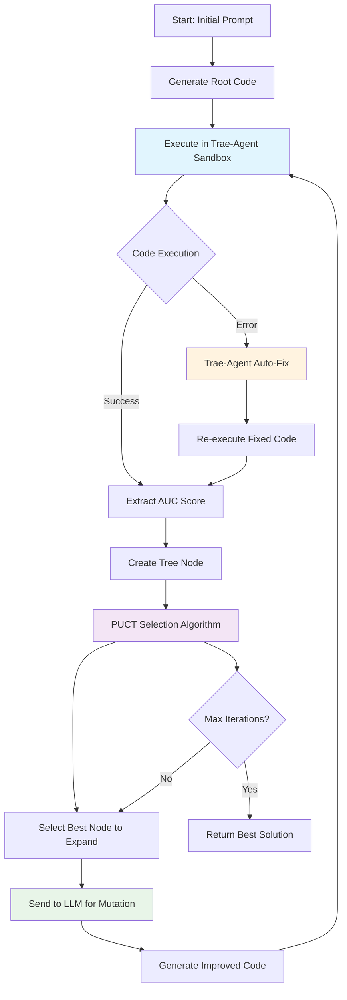

# AviaAutoML System Architecture

## System Overview

The AviaAutoML system is an **AI-powered automated machine learning research platform** that uses **Large Language Models (LLMs) guided by Tree Search algorithms** to iteratively discover, generate, and optimize machine learning solutions.

## Core Components

### 1. **Controller (Brain)**
- **Tree Search Engine**: Implements PUCT (Predictor + Upper Confidence bounds applied to Trees) algorithm
- **Node Management**: Tracks all code variations and their performance scores
- **Selection Strategy**: Intelligently chooses which code variations to explore next
- **Search Orchestration**: Coordinates the entire discovery process

### 2. **LLM Worker (Code Generator)**
- **Gemini 2.5 Pro Integration**: Uses Google Cloud VertexAI for code generation
- **Code Mutation**: Takes existing code and generates improved variations
- **Prompt Engineering**: Crafts specific instructions for ML code improvement
- **Multiple Provider Support**: Can use OpenAI GPT-4 as alternative

### 3. **Trae-Agent Sandbox (Secure Executor)**
- **Safe Code Execution**: Runs generated ML code in isolated environment
- **Auto Error Fixing**: Automatically detects and fixes syntax, import, and logic errors
- **Performance Evaluation**: Extracts AUC scores from executed code
- **Gemini-Powered Debugging**: Uses AI to understand and fix code issues

### 4. **Data Management**
- **Automatic Data Download**: Fetches AI4I 2020 Predictive Maintenance Dataset
- **Data Preprocessing**: Handles failure type conversion and train/test splitting
- **Validation Sets**: Creates consistent evaluation datasets

## System Workflow



## Detailed Data Flow

### Phase 1: Initialization
1. **Environment Setup**: Configure Google Cloud Project ID for Gemini 2.5 Pro
2. **Data Download**: Run `download_data.py` to fetch and prepare dataset
3. **Trae-Agent Activation**: Ensure sandbox environment is ready
4. **Root Code Generation**: Create initial baseline ML solution

### Phase 2: Tree Search Loop
1. **Node Selection**: PUCT algorithm selects most promising code variant
2. **Code Mutation**: LLM generates improved version based on:
   - Previous code
   - Performance score
   - Task description
   - Improvement strategies
3. **Sandbox Execution**: Trae-agent runs the code safely with auto-fixing
4. **Score Evaluation**: Extract AUC performance metric
5. **Tree Update**: Add new node to search tree
6. **Backpropagation**: Update visit counts in search tree

### Phase 3: Result Output
1. **Best Solution**: Identify highest-scoring code variant
2. **Code Analysis**: Show improvement trajectory
3. **Performance Metrics**: Display final AUC score and comparisons

## Key Algorithms

### PUCT Selection Formula
```
PUCT_Score = RankScore + C_puct * sqrt(log(total_visits) / node_visits)
```
- **RankScore**: Normalized ranking based on performance (0-1)
- **Exploration Term**: Encourages trying less-visited nodes
- **Balance**: Exploits good solutions while exploring new possibilities

### Code Improvement Strategies
- **Model Selection**: Try different algorithms (Random Forest, XGBoost, Neural Networks)
- **Feature Engineering**: Add polynomial features, feature selection, scaling
- **Hyperparameter Tuning**: Optimize model parameters
- **Ensemble Methods**: Combine multiple models
- **Data Preprocessing**: Handle missing values, outliers, class imbalance

## Technical Architecture

### Component Integration
```
┌─────────────────┐    ┌─────────────────┐    ┌─────────────────┐
│   Controller    │◄──►│   LLM Worker    │◄──►│ Gemini 2.5 Pro  │
│  (Tree Search)  │    │ (Code Generator)│    │   (VertexAI)    │
└─────────────────┘    └─────────────────┘    └─────────────────┘
         │                       │
         ▼                       │
┌─────────────────┐              │
│  Search Tree    │              │
│   (Nodes &      │              │
│   Scores)       │              │
└─────────────────┘              │
         │                       ▼
         ▼              ┌─────────────────┐
┌─────────────────┐    │  Trae-Agent     │
│   Data Manager  │◄──►│   Sandbox       │
│ (Dataset, Eval) │    │ (Safe Execution)│
└─────────────────┘    └─────────────────┘
```

### Security & Reliability Features
- **Sandboxed Execution**: No dangerous `exec()` calls - uses trae-agent isolation
- **Auto Error Recovery**: Gemini-powered debugging fixes broken code automatically
- **Timeout Protection**: Prevents infinite loops or hanging processes
- **Resource Management**: Controlled memory and CPU usage
- **Fallback Mechanisms**: Multiple data sources and LLM providers

## Performance Characteristics

### Expected Improvements
- **Initial Baseline**: ~0.70-0.80 AUC (simple logistic regression)
- **After Optimization**: ~0.85-0.95 AUC (advanced ensemble methods)
- **Iteration Count**: 20-50 iterations for significant improvement
- **Time per Iteration**: 1-3 minutes (including LLM calls and execution)

### Scalability Features
- **Parallel Evaluation**: Can run multiple trae-agent instances
- **Caching**: Store successful code patterns for reuse
- **Incremental Learning**: Build upon previous successful runs
- **Resource Optimization**: Efficient memory and compute usage

## Advanced Features

### Research Idea Injection
- Input: "Use gradient boosting with early stopping"
- System: Incorporates specific ML techniques into code generation prompts
- Result: Targeted exploration of specific methodologies

### Code Recombination
- Identify two high-performing solutions with different strategies
- LLM creates hybrid combining best aspects of both
- New search branch explores hybrid variations

### Tree Visualization
- Export search tree as JSON or Graphviz format
- Visualize exploration patterns and convergence
- Analyze which strategies led to best improvements

This architecture creates an **autonomous ML researcher** that can discover novel solutions through intelligent exploration and AI-powered code generation!